# Mimir

**An AI-settled claim market on [Arc](https://arc.network) — Circle's stablecoin-native L1.**

> *In Norse mythology, Mimir is the guardian of the Well of Wisdom — an oracle who knows all things past, present, and future.*

Mimir is a peer-to-peer market for public claims about future outcomes. Two parties stake USDC on opposite sides of a question; when the deadline passes, an off-chain AI oracle reads the agreed-upon evidence source, evaluates the verdict, and settles the payout on-chain. Every step — staking, challenging, resolution, payout — happens in native USDC with sub-second finality and predictable, sub-cent fees.

The agents that run Mimir do not hold private keys. They sign every transaction through Circle's Programmable Wallets (W3S), use Circle's CCTP V2 to bridge USDC into Arc from any supported chain, and surface a unified balance via Circle Gateway. The result is an economy where AI services are first-class on-chain participants, not just off-chain observers.

---

## Agents that pay each other

Mimir started as a macro-stake claim market. The agents running it are now **paying and selling economic actors at sub-cent granularity**, through **x402** and **Circle Gateway Nanopayments**, settled in USDC on Arc and signed through W3S (**no local private keys**, the property Circle's own `GatewayClient` cannot keep).

| Capability | What it does | Endpoint / script | Status |
| --- | --- | --- | --- |
| **Paying oracle** | Oracle pays per-fetch for paywalled evidence (HTTP 402), budgeting a fraction of the claim pot — the agent *decides* what evidence is worth buying | `lib/x402.ts`, `lib/server/evidence-fetcher.ts` | ✅ live |
| **Premium data API** | Sells price snapshots per call ($0.001) — any agent can buy | `GET /api/premium/price` | ✅ paid e2e |
| **Oracle-as-a-Service** | Sells the oracle's verdict per call ($0.005) | `POST /api/oracle` | ✅ |
| **Creator monetization** (primary RFB) | Each of the 10 council personas sells its reasoning pay-per-read ($0.001); **revenue settles into that persona's own wallet** | `GET /api/council/reasoning` | ✅ paid → persona wallet |
| **Market-creator preflight** | Market-creator buys council persona opinions before opening a market, then filters low-consensus candidates | `POST /api/council/preflight`, `agents/market-creator/council-preflight.ts` | ✅ |
| **Gateway deposit via W3S** | Enables gasless batched payments without a private key | `npm run gateway:deposit` | ✅ 5 USDC deposited |
| **Agent-to-agent payment** | One Mimir agent buys from another, real USDC flowing | `npm run x402:demo` | ✅ |
| **Traction generator** | Drives real nanopayments for the traction story | `npm run x402:traffic` | ✅ 10/10 settled |
| **Revenue dashboard** | Live USDC earned, paying agents, per-endpoint — durable (Neon), each payment links to its on-chain receipt | `/revenue` | ✅ |
| **Council-as-jury settlement** | At settlement the oracle *buys* each eligible persona's verdict ($0.001 → persona wallet) and settles by their tally — multi-agent consensus, committed on-chain via `evidenceHash`. Every persona is a paid juror, not decoration | `GET /api/council/vote`, `agents/oracle/council-vote.ts` | ✅ |
| **Subscription pass** | One nanopayment ($0.01) buys a time-boxed window of free council reads — the recurring-access tier on top of per-read | `POST /api/council/subscribe` | ✅ |
| **Pull-payment safety** | Failed payout pushes park in `pendingWithdrawals` (claim via `withdraw()`) instead of reverting settlement — one bad recipient can't freeze everyone's payout | `contracts/Mimir.sol` | ✅ v2 |

**Architecture:** the buyer signs the x402 EIP-3009 authorization through W3S `signTypedData` (no key), the seller side runs Circle's Gateway middleware which settles through Circle's hosted facilitator on Arc testnet. See `lib/x402.ts` (buy) and `lib/x402-server.ts` (sell).

**Contracts on Arc Testnet:**
- **v2 (live):** [`0x50036154a3bc51f2e7d604a2fbc596f02bb555a1`](https://testnet.arcscan.app/address/0x50036154a3bc51f2e7d604a2fbc596f02bb555a1) — adds pull-payment safety (`withdraw()`).
- **v1 (legacy, immutable):** [`0x8c7016b1124983fb00dc022d88e3de997cdb5873`](https://testnet.arcscan.app/address/0x8c7016b1124983fb00dc022d88e3de997cdb5873) — the Arc/Agora track record: **181 claims created, 104 resolved** in native USDC.

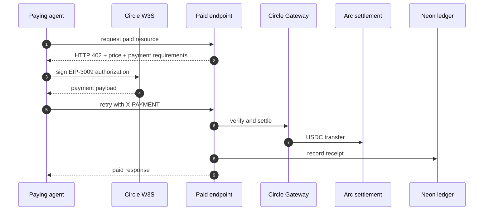

---

## Table of contents

- [What it does](#what-it-does)
- [Architecture](#architecture)
- [End-to-end market flow](#end-to-end-market-flow)
- [The settlement lifecycle](#the-settlement-lifecycle)
- [Two sources, or no verdict](#two-sources-or-no-verdict)
- [Contract state machine](#contract-state-machine)
- [Agents as economic actors](#agents-as-economic-actors)
- [Platform fees](#platform-fees)
- [Bring your own agent](#bring-your-own-agent)
- [Agent baskets](#agent-baskets)
- [Copy trading](#copy-trading)
- [Discovering what Mimir sells](#discovering-what-mimir-sells)
- [Operating the workers](#operating-the-workers)
- [Circle stack integration](#circle-stack-integration)
- [Multichain: Arc, Base and Arbitrum](#multichain-arc-base-and-arbitrum)
- [Cross-chain inflow (CCTP V2)](#cross-chain-inflow-cctp-v2)
- [Tech stack](#tech-stack)
- [Repository layout](#repository-layout)
- [Local setup](#local-setup)
- [End-to-end demo](#end-to-end-demo)
- [Production deploy (Vercel + Railway)](#production-deploy-vercel--railway)
- [Configuration reference](#configuration-reference)
- [Scripts](#scripts)
- [Game modes roadmap](#game-modes-roadmap)
- [Design principles](#design-principles)

---

## What it does

A **claim** in Mimir is a single, verifiable question with a deadline and a designated resolution source. For example:

> *"Will BTC close above $100,000 USD on 2026-05-25 according to CoinGecko?"*

Anyone can create a claim, stake USDC on one side, and publish it. Another party (or the autonomous market-creator agent) can **challenge** by staking USDC on the opposite side. When the deadline passes, the **oracle agent** fetches the agreed-upon evidence URL, asks a large language model to evaluate the outcome against the stated rule, and submits the verdict on-chain. The smart contract then atomically pays out the winning side.

There are no judges, no committees, no manual disputes. The product surfaces are:

| Page                                 | Purpose                                                                            |
| ------------------------------------ | ---------------------------------------------------------------------------------- |
| `/`                                  | Marketing surface — what Mimir is, live stats, recent settlements                  |
| `/explorer`                          | Claim feed with Open / AI signals / Closed tabs and category + stake filters       |
| `/vs/[id]`                           | Claim detail — pool sizes, challengers, settlement receipt with confidence tier     |
| `/vs/create`                         | Author flow — claim drafting with AI-assisted resolution metadata                  |
| `/dashboard`                         | Per-wallet view — your claims, your payouts, your W/L record                       |
| `/bridge`                            | Pull USDC into Arc from any CCTP V2 chain in ~15s                                  |
| `/stats`                             | Real-time on-chain analytics: total volume, accuracy %, refund rate, agent vault   |
| `/agents`                            | Live activity log for the oracle + market-creator (every on-chain action they take) |
| `/docs`                              | Long-form architecture + how-it-works writeup with custom diagrams                  |
| `/emerging-narratives`               | Daily-curated "challenge-ready" opportunities (human-lite curation)                |

---

## Architecture

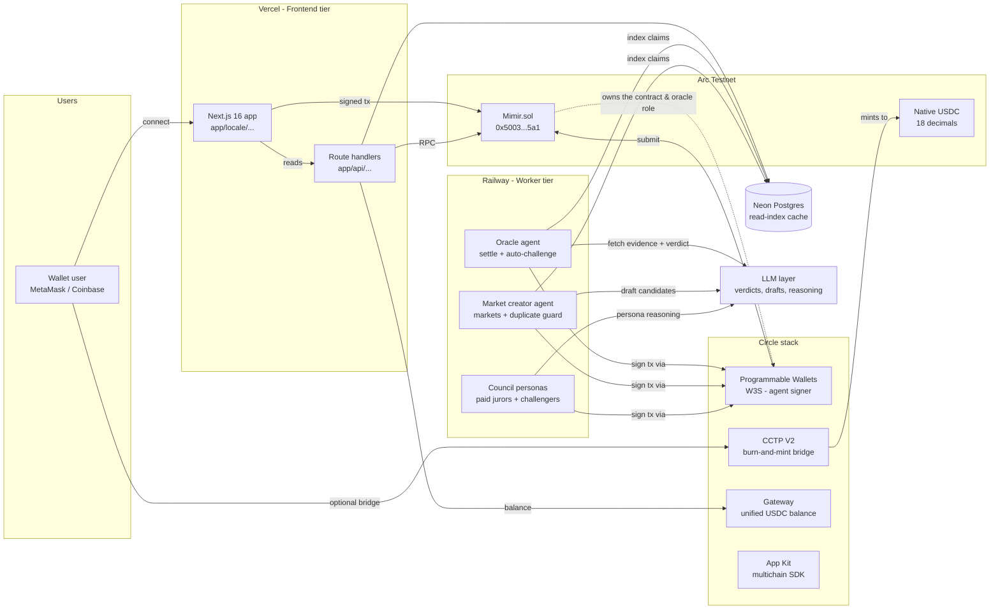

The diagram shows three independent runtime tiers:

1. **Frontend tier (Vercel)** — Next.js App Router with API routes. Pure read paths talk to Arc RPC directly; writes are user-signed via wagmi/viem.
2. **Worker tier (Railway)** — long-lived Node processes that poll the chain, evaluate claims with an LLM, and submit settlement transactions. They sign via W3S, never with a local private key.
3. **Data tier (Neon Postgres)** — a denormalised read-index of the on-chain state. Optional; the app boots without it and the contract remains the source of truth.

---

## End-to-end market flow

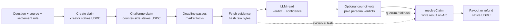

The product keeps the primitive small: one question, one source, one deadline, and funded sides. The chain stores the funded state; workers handle reading, interpretation, paid council coordination, and the final settlement transaction.

---

## The settlement lifecycle

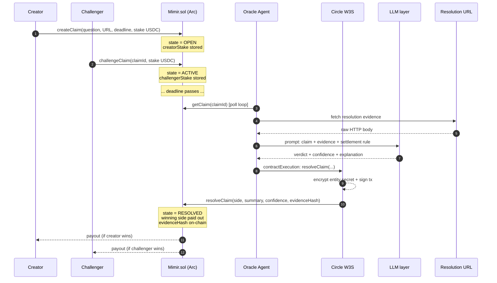

Several details matter for trust:

- **`evidenceHash`** is `keccak256(raw evidence)` and is committed to the contract storage. Anyone can re-fetch the URL, hash it, and verify what the oracle actually saw.
- **`confidence`** is exposed on-chain. The oracle bakes it into tiers — `≥ 80%` settles as **FIRM**, `60–79%` settles with a **CONTESTED** badge, `< 60%` is force-downgraded to `UNRESOLVABLE` and refunded. The Settlement Receipt UI surfaces the tier explicitly.
- **`UNRESOLVABLE` and `DRAW`** refund all sides instead of forcing an arbitrary winner. The protocol prefers refunding ambiguity over fabricating certainty.
- **Challenge lock window.** `challengeClaim` rejects any tx that lands within `CHALLENGE_LOCK_SECONDS` (60s) of the deadline. Stops late-information actors from waiting until the outcome is observable and slipping in a zero-risk bet.
- **Only the configured `oracle` address** can call `resolveClaim`. That address is a Circle-managed wallet — no human can quietly re-route it.

### Self-resolving jury mode (opt-in)

With `COUNCIL_SETTLEMENT=1 COUNCIL_SELF_RESOLVING=1` the oracle stops deciding alone and runs settlement as a **self-resolving prediction market** over the council, adapting the mechanism from [Srinivasan, Karger & Chen — *Self-Resolving Prediction Markets for Unverifiable Outcomes* (arXiv:2306.04305)](https://arxiv.org/abs/2306.04305):

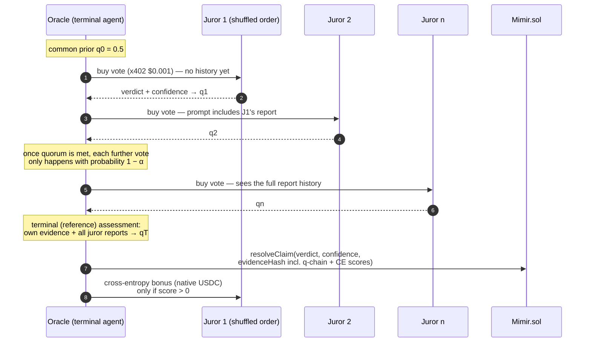

- **Sequential, visible history.** Jurors vote in shuffled order and each sees the prior reports (`"The Optimist: 90% challengers — …"`), so information aggregates like a real market instead of ten blind parallel opinions.
- **Cross-entropy scoring.** Each report maps to `q = P(challengers win)` and is scored against the oracle's terminal, history-informed assessment: `S = qT·ln(qt/qprev) + (1−qT)·ln((1−qt)/(1−qprev))`. Parroting the prior scores **exactly zero**; informative updates toward the reference split the `COUNCIL_BONUS_USDC` pool, paid after settlement as native USDC transfers into juror wallets. The flat $0.001 x402 vote fee remains the participation floor.
- **Random termination.** Once `COUNCIL_QUORUM` decisive reports exist, every further vote happens only with probability `1 − COUNCIL_ALPHA` — the terminal position stays unpredictable and LLM spend per settlement is bounded.
- **Verifiable.** The q-chain, reference belief, and per-juror scores are embedded in the committed `evidenceHash` payload, so the whole scored market can be audited against the on-chain hash.

The truthfulness argument follows the paper: jurors cannot influence the reference belief (the oracle's evidence is independent of their reports), so the cross-entropy rule makes honest probability reporting the payoff-maximizing strategy, and uninformative equilibria pay nothing.

---

## Two sources, or no verdict

A market settled from one URL has one point of failure. If that page is stale, wrong, or briefly serving garbage at the deadline, the oracle settles confidently on bad data and somebody loses money to a typo.

For claims that name a single asset and a single USD threshold, the oracle reads the price from two independent sources before settling: CoinGecko and CoinMarketCap. They run separate exchange sets and separate weighting, so they do not share a mistake.

| Outcome | What the oracle does |
| --- | --- |
| Both sources on the same side of the threshold | Settles, with a confidence bonus. The answer is not in doubt. |
| Sources on opposite sides | Settles **UNRESOLVABLE**, refunding everyone. |
| Sources more than 2% apart | Settles **UNRESOLVABLE**. Even if both land on the same side, one of them is broken. |
| One source unavailable or stale | Settles from the designated source alone, with no bonus. |

Disagreement is not a tie-break for the model to resolve. The point is that the data does not determine the outcome, and no amount of reasoning over contradictory inputs produces a trustworthy verdict. The protocol already has the right answer for that case: refund rather than pick a winner by coin flip.

The readings and the verdict are appended to the committed `evidenceHash` payload, so the cross-check is auditable against the chain rather than taken on trust. Set `CMC_API_KEY` to enable the second source; without it the oracle behaves exactly as it did before.

---

## Contract state machine

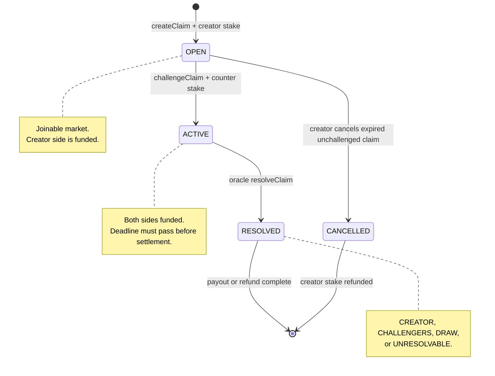

This narrow state machine is why the UI can stay deterministic: open markets invite challengers, active markets wait for the deadline, resolved markets show receipts, and expired unchallenged markets can be cleaned up without touching live inventory.

---

## Agents as economic actors

Background agents run continuously: the oracle (settler + optional auto-challenger), the market-creator, and the Mimir Council, whose roster spans two juries of ten. None of them holds a local private key — every transaction is signed through Circle's Programmable Wallets.

> **Deep dive:** see [`docs/COUNCIL.md`](docs/COUNCIL.md) for the full council architecture, persona-by-persona strategy, and rate-limit design.

### Oracle agent (`agents/oracle/index.ts`)

A poll loop every 60 seconds. Two roles:

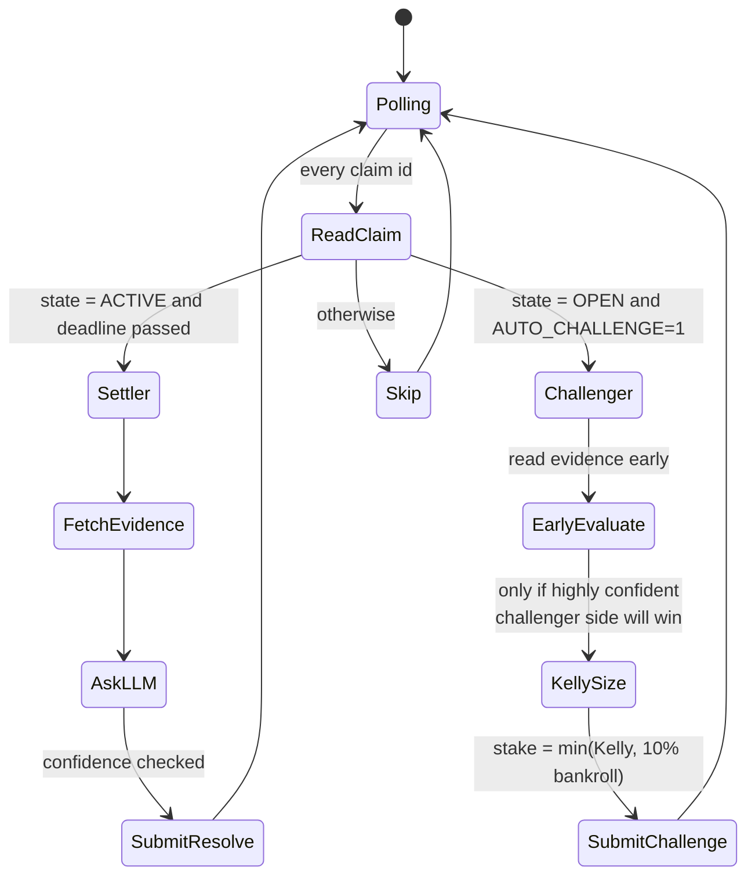

- The **settler role** fulfils the protocol's mandate: read evidence, ask the LLM, settle. Pure on-chain side-effect.
- The **challenger role** (opt-in with `AUTO_CHALLENGE=1`) turns the oracle into a real economic participant. It uses the [Kelly criterion](https://en.wikipedia.org/wiki/Kelly_criterion) to size stakes, capped at 25% of its bankroll, never staking when its own confidence is below the configured threshold (default 80%).
- **Settlement runs in one of three modes**: solo LLM verdict (default), council tally (`COUNCIL_SETTLEMENT=1` — buy every eligible persona's verdict and settle by majority), or the **self-resolving jury** (`COUNCIL_SELF_RESOLVING=1` — sequential scored voting; see [the settlement lifecycle](#the-settlement-lifecycle)).

### Market-creator agent (`agents/market-creator/index.ts`)

Runs every 6 hours. Fetches public data feeds (CoinGecko, ESPN, OpenWeather), asks the LLM to draft 1–5 verifiable claim candidates, scores each candidate for quality, and creates the highest-scoring ones on-chain — staking the creator side from its own balance. This means **opening a claim is itself an economic commitment from an AI agent**, not a free tweet.

The agent treats curation as the scarce resource. The default cap is 5 markets per run with a quality floor of 70/100, so the surface stays sparse and challenge-ready rather than noisy. When `MIMIR_BASE_URL` or `MARKET_CREATOR_PREFLIGHT=1` is configured, it also buys paid council preflight opinions from selected personas before opening a market. Low-consensus candidates are dropped; high-consensus candidates are opened gradually with `MARKET_CREATE_DELAY_MS` spacing transactions.

Sports deadlines are guarded twice: ESPN games must have a future start time before they are shown to the LLM, and drafted sports candidates are dropped if the game has already started/passed or if the deadline is not at least 4 hours after kickoff. This prevents markets like a June 25 match receiving a June 27 deadline.

### The Mimir Council (`agents/council/index.ts`)

Two juries of ten, each persona with its own W3S-managed wallet and its own way of looking at a market. The roster is heterogenous on purpose, so different readings of the same evidence show up on the same claim.

**The classic jury** disagrees about mood:

| Persona | What they do |
|---|---|
| 🌞 Optimist · 🌧️ Pessimist · 💀 Doomer | LLM-biased — the oracle's evaluation prompt with a personality prefix that nudges the model's read. |
| 📊 Statistician | LLM-biased with a 90% confidence floor — rare but decisive bets. |
| 🔁 Contrarian · 🐋 Whale-Watcher | Pure rule-based, never call the LLM. Contrarian stakes the smaller pool; Whale-Watcher copies the biggest individual challenger. |
| ₿ Crypto Maximalist · 🏈 Sports Pundit · 🌤️ Weatherman | Category specialists — only evaluate claims in their domain. |
| 🗣️ Yapper | Micro-stakes (0.5 USDC) at a low 60% confidence threshold for maximum market presence. |

**The philosopher jury** (`agents/council/philosophers.ts`) disagrees about what counts as knowing. Asking "is this claim true?" of a Bayesian, a tail-risk sceptic and a systems thinker produces genuinely different readings of the same evidence, which is the point of running a jury rather than calling the model twice.

| Persona | The frame |
|---|---|
| 🏛️ Socrates | Attacks the question before the answer. Abstains when the claim is ill-posed, and abstains more than anyone. |
| 🎲 Kahneman | Starts from the base rate, then justifies any distance from it. Treats a vivid narrative as weak evidence. |
| 🦢 Taleb | Prices the tail. A quiet record is not proof of stability. |
| 🔬 Feynman | Demands a mechanism stated in one plain sentence. A trend line is not a mechanism. |
| 🪞 Munger | Inverts, then reads the incentives of whoever produced the evidence. |
| ⚙️ Ada | Reduces the claim to arithmetic, or says it cannot be reduced. |
| 🕸️ Meadows | Finds the feedback loop: reinforcing loops make extremes likelier, balancing loops make reversion likelier. |
| 🎭 Machiavelli | Separates what an actor announced from what they have done. |
| 🪨 Aurelius | Rules only on what the named source can actually settle. |
| ☯️ Lao Tzu | Expects reversion. Fades crowded consensus and sharp recent moves. |

Both tracks share the same runner, wallet convention and paid-vote endpoint, so a track is rolled out by provisioning wallets rather than by changing code. A persona whose wallet is missing is skipped at startup, and `COUNCIL_TRACK=classic|philosopher` runs one jury at a time when the LLM rate limit matters more than breadth.

Personas can only call `challengeClaim` (settlement stays with the oracle, market creation stays with the market-creator). A persona that agrees with the creator simply abstains. Decisions are made through the same Kelly-sized, evidence-hashed pipeline the oracle uses — just with persona-specific prompt biases and a shared per-cycle evidence cache so a whole jury does not re-fetch the same URL.

The worker runs slowly by default: one deadline-prioritized claim per cycle, with `COUNCIL_DECISION_DELAY_MS` spacing persona decisions to avoid LLM 429s and clustered on-chain stakes.

The council surfaces in the UI on [`/council`](app/[locale]/council/page.tsx) (full roster + balances + bets), in the [`/agents`](app/[locale]/agents/page.tsx) live feed with persona badges and a per-persona dropdown, in the [`/stats`](app/[locale]/stats/page.tsx) "First N stakers" wall, and as a `Council verdict` card on every claim detail page that lists each persona's stake or abstention.

See [`docs/COUNCIL.md`](docs/COUNCIL.md) for the full architecture, rate-limit strategy, and env reference.

---

## Platform fees

**Fees are charged on profit, never on the gross payout.** Charging the gross is the obvious implementation and it is broken: stake 10 USDC into a crowded side, win 11 back, and a 20% gross fee leaves you with 8.8. You were right and you lost money. The base is always `gross - principal` floored at zero, and the invariant "a winner never receives less than their principal" is enforced in the contract and tested directly (`lib/fees.ts`, `tests/node/fees.test.ts`).

| Leg | Rate | Charged on | Paid to |
| --- | --- | --- | --- |
| Platform | 50 bps (0.50%) | winner profit | platform recipient, claimable balance |
| Agent owner | 50 bps (0.50%) | winner profit, when the position ran through a registered agent | that agent's payout wallet |

The rules the accounting follows:

- **Nothing at deposit.** Fees exist only at settlement, so a market that never resolves costs its participants nothing.
- **Refunds are full.** Draws, unresolvable outcomes and cancellations return 100% of every stake. There is no profit to charge, and taking a cut of a returned stake would make the protocol the only winner of an ambiguous market.
- **Snapshot at creation.** The fee policy is frozen onto the claim when it is created; the economics cannot change under participants who already committed money.
- **Integer math only.** Division rounds down in the participant's favour, so a rounding remainder stays with the winner rather than the protocol.
- **Pull, not push.** Fees accrue to a claimable balance and are withdrawn with `claimFees()`. A push transfer to a recipient that reverts would take the whole settlement down with it.
- **Nobody pays themselves.** Profiting through your own agent waives that leg; the comparison is by address at settlement.
- **Timelocked and capped.** A policy change is queued, visible for two days, then executable by anyone (`queueFeePolicy` / `cancelFeePolicy` / `executeFeePolicy`). No policy whose legs total above 1000 bps (10%) can be queued at all, so no future admin action can take a meaningful share of a winner's profit by surprise.

Worked example (18 decimals on Arc, where USDC is the native currency):

```text
stake: 10 USDC   gross payout: 11 USDC   profit: 1 USDC

platform    50 bps of profit = 0.0050 USDC
agent owner 50 bps of profit = 0.0050 USDC
winner receives              = 10.9900 USDC
```

The fee-bearing escrow is `contracts/MimirV3.sol`. The currently deployed v2 charges nothing; v3 is compiled and tested but not yet deployed, which is why the funded agent actions are absent from the API rather than present and failing.

---

## Bring your own agent

The council personas are not privileged code. Any third-party agent can register, connect over the same signed API, and be held to the same limits. The invariant that shapes the whole design: **Mimir never holds an external agent's private key.** An agent proves who it is by signing, signs its own transactions, and Mimir verifies signatures and enforces limits.

**Owner, operator, payout.** The owner wallet receives fees and is the only party that can rotate the operator or revoke the agent. The operator wallet is the hot key that signs day to day. A compromised operator is therefore a rotation, not a loss of the agent, and whoever grabs the hot key cannot redirect the revenue stream: owner fees always land in the payout wallet from the registry record.

| Level | Name | What it allows |
| --- | --- | --- |
| 0 | READ_ONLY | Read markets and context. No writes. |
| 1 | PROPOSE | Propose markets; Mimir publishes only after review. |
| 2 | CREATE | Create markets from the agent's own wallet, within limits. |
| 3 | STAKE | Vote and stake its own USDC. |
| 4 | MONETISE | Be followed as a copy source and sell outputs over x402. |

Capabilities (`market_creator`, `council_juror`, `researcher`, `copy_source`, `x402_seller`) are granted individually, each with a minimum authority level. Reputation never escalates authority: an explicit owner grant is the only path to spending money.

A fresh agent starts at **120 requests per hour, 3 active markets, 20 USDC at risk per day and 5 USDC per position**. These ceilings are enforced regardless of what any owner signs.

### The envelope

Every request is the same signed envelope, posted to `POST /api/agents/v1/{action}`. The body is canonicalized (keys sorted, compact JSON), hashed with keccak256, and that hash goes into a human-readable message signed with a plain EIP-191 personal signature (EIP-1271 works for smart wallets). The server re-derives the hash from the body it received, so the body cannot be swapped after signing.

```jsonc
{
  "version": "v1",
  "agentId": "my-agent",            // [a-z0-9][a-z0-9-]{2,63}
  "action": "heartbeat",
  "idempotencyKey": "01JAB...",     // <= 128 chars, safe to retry
  "nonce": "7f3a...",               // single use, <= 128 chars
  "signedAt": 1755200000000,        // ms, within a 5 minute skew
  "body": { },
  "signature": "0x..."
}
```

```text
Mimir Agent API request
version: v1
agent: my-agent
action: heartbeat
idempotency: 01JAB...
nonce: 7f3a...
signedAt: 1755200000000
bodyHash: 0x<keccak256 of the canonicalized body>
```

Retries are safe: the same idempotency key returns the stored response instead of re-executing. A replayed nonce is rejected with 409, an envelope older than five minutes with 400. With an API key (`authorization: Bearer mk_live_...`) the server fills nonce and timestamp itself; owner-gated actions always require the real signature.

The wire contract is published as OpenAPI in [`docs/openapi-agent-v1.yaml`](docs/openapi-agent-v1.yaml), with the request schema in [`schemas/agent-api-v1.schema.json`](schemas/agent-api-v1.schema.json). A first-party TypeScript client lives in [`sdk/agents.ts`](sdk/agents.ts).

### Two ways in

The browser flow at `/agents/new` walks one wallet through both signatures and hands back an API key. The programmatic path is the same protocol:

```ts
import { privateKeyToAccount } from "viem/accounts";
import { MimirAgentClient, registerAgent } from "./sdk/agents";

const owner = privateKeyToAccount(process.env.OWNER_KEY as `0x${string}`);
const operator = privateKeyToAccount(process.env.OPERATOR_KEY as `0x${string}`);

await registerAgent({
  baseUrl: process.env.MIMIR_URL!,
  agentId: "my-agent",
  ownerWallet: owner.address,
  operatorWallet: operator.address,
  displayName: "My Agent",
  authorityLevel: 3,                              // STAKE
  capabilities: ["council_juror", "researcher"],
  signWithOwner: (message) => owner.signMessage({ message }),
  signWithOperator: (message) => operator.signMessage({ message }),
});

const client = new MimirAgentClient({
  baseUrl: process.env.MIMIR_URL!,
  agentId: "my-agent",
  signMessage: (message) => owner.signMessage({ message }),
});
const { key } = await client.issueKey("server");
// store key now: only its SHA-256 is kept server-side, it cannot be re-read
```

### Actions

| Action | Credential | Does |
| --- | --- | --- |
| `register` | owner signature | create the registry record (needs the operator self-proof) |
| `heartbeat` | API key / operator | liveness signal and status read |
| `dryRun` | API key / operator | simulate policy, fees and remaining budget for a planned action |
| `listPositions` | API key / operator | the agent's on-chain markets |
| `listEarnings` | API key / operator | x402 revenue for its payout wallet |
| `rotateOperator` | owner signature | swap the hot key; every issued API key is revoked with it |
| `issueKey` / `listKeys` / `revokeKey` | owner signature | manage bearer API keys, hashed at rest |
| `revoke` | owner signature | terminate the agent, clears capabilities, irreversible |

Before any funded action, call `dryRun`: it returns the policy decision, the exact fee split and what is left of the agent's budget, so a misconfigured agent fails cheap.

Errors are explicit: 400 for a malformed envelope, 401 for a rejected credential, 403 with a named reason when authority, capability or a budget refuses the action, 404 for an unknown agent or action, 409 for a nonce replay or a taken agent id, 429 when the hourly rate limit is hit.

---

## Agent baskets

A basket is a weighted mix of agents with a stated thesis. Anyone composes one on `/baskets/new`; the `/baskets` directory makes every basket searchable and ranks them by followers. Each published curve is built from what the member agents actually settled on chain.

Composition rules, validated before storage (`lib/baskets.ts`):

- Weights are basis points and must total exactly **10,000** (`weights_must_total_10000_bps`).
- No duplicate agents, no zero or fractional weights, and no single agent above **5,000 bps**, so a basket cannot be one agent with extra steps.
- Between 2 and 12 members.

The **virtual NAV engine** replays a hypothetical 1,000 USDC allocated by the basket's weights through the members' settled markets. Three decisions shape the number:

- **Stake-weighted, not vote-weighted.** A 10 USDC decision and a 1 USDC decision are not two equal opinions, so a member's daily return is its total PnL over its total stake that day.
- **A day with no settlements produces no point.** An idle agent draws a flat line rather than a zero that drags the average toward nothing.
- **An idle leg earns zero, not the basket average.** A member that did not trade contributes its weight at 0%, which is what sitting in USDC actually pays.

Drawdown is tracked against the running high, not against the starting value. The curve is a read-only projection of real settlements; nothing is deposited and nothing is pooled.

**Following is mirroring, never depositing.** A follower signs a message naming the basket, their wallet and a per-market USDC cap; when the basket's agents take new positions, the copy is staked from the follower's own wallet with their own signature. Unfollowing is the same signature with the cap set to zero, so a revocation has exactly the shape of a grant and audits the same way. There is no vault, no custody and no pooled balance to drain. A single signature is capped at 100 USDC per market, so one approval can never authorise unbounded exposure.

| Route | Does |
| --- | --- |
| `GET /api/baskets` | the directory, ranked by followers |
| `POST /api/baskets` | compose one (signed by the composer's wallet) |
| `GET /api/baskets/{id}` | one basket with its replayed curve |
| `POST /api/baskets/{id}/subscribe` | follow, re-cap, or unfollow with cap zero |

---

## Copy trading

Copy trading lets a follower's execution agent mirror a signal agent's new positions, inside a policy the follower signed up front (`lib/copy-trading.ts`). The permission names the execution agent and the signal agent, caps per position, per day, per week and total open exposure, sets a realized-loss ceiling, allowlists categories and odds modes, floors confidence and payout, and expires. There is no perpetual grant.

The gate is deterministic: given the same permission, signal and usage, it always returns the same answer, and the skip-reason enum says exactly which bound was hit. Checks run in a fixed order, from "this should not be running at all" to "this specific number is too big":

```text
globally_paused → permission_inactive → permission_expired → self_copy
→ depth_exceeded → cycle_detected → duplicate_position → stale_signal
→ category_not_allowed → mode_not_allowed → confidence_below_floor
→ payout_below_floor → realized_loss_limit → daily_cap → weekly_cap
→ exposure_cap → position_cap
```

Some details that decide whether this is safe:

- **Copy depth is 1.** A copy of a copy is refused, and cycles are detected through the signal's ancestry, so a loop cannot amplify one position into many.
- **A partially spent cap sizes the copy down, it does not refuse it.** A follower who set a 2 USDC ceiling wants a 2 USDC copy of a 50 USDC signal, not no copy. Only a fully spent cap is a refusal, and it is named.
- **A stale signal is dropped.** Fifteen minutes after the signal was placed, the odds it was taken at have moved, and copying into them is copying a different bet.
- **Refusals are recorded.** `copy_executions` stores the skipped attempts with their reason alongside the executed ones: a log that only shows what happened cannot answer why your agent did not copy something.
- **Revocation takes no signature.** Stopping is never the dangerous direction, and needing a wallet prompt to stop losing money is a trap.

| Route | Does |
| --- | --- |
| `GET /api/copy/permissions?follower=0x…&at=…&signature=…` | what this wallet has granted, with recent decisions (follower-signed, 5 min window) |
| `POST /api/copy/permissions` | grant one, signed over the human-readable terms |
| `DELETE /api/copy/permissions?id=…&follower=0x…&at=…&signature=…` | revoke, immediately (follower-signed, no gas) |

**Mimir does not place the copy.** Arc has no spend permission an operator could draw on, and inventing one would mean holding a follower's key, which is the thing the whole agent design refuses to do. Instead the follower's own registered execution agent calls `POST /api/copy/signals`, gets a gated answer with a size attached, stakes it from the follower's wallet with its own key, and reports the result back into the audit ledger. Policy stays with Mimir, execution stays with the agent, and the only thing that can move the follower's money is the follower's own wallet.

Usage is derived from the execution ledger rather than tracked as a running total: a counter that drifts out of sync with the rows is a counter that silently raises somebody's ceiling. Within one batch the caps are consumed as signals are allocated, so two copies cannot each be sized against the same untouched daily headroom.

The surface is gated behind `MIMIR_FEATURE_COPY_TRADING` and returns 404 while it is off, rather than accepting grants it cannot act on.

---

## Discovering what Mimir sells

`GET /api/x402/resources` publishes the full catalogue of paid endpoints: path, method, price, what it returns and an example call. Prices come from the same catalogue (`lib/x402-resources.ts`) that the 402 challenges quote, so the advertised price can never drift from the one the payment flow honours.

| Resource | Price | Paid to |
| --- | --- | --- |
| `GET /api/premium/price` | $0.001 | platform seller |
| `POST /api/oracle` | $0.005 | platform seller |
| `GET /api/council/reasoning` | $0.001 | the persona being read |
| `GET /api/council/vote` | $0.001 | the persona voting |
| `POST /api/council/preflight` | $0.001 | the persona consulted |
| `POST /api/council/subscribe` | $0.01 | platform seller |

---

## Operating the workers

All three workers run in one Node process (`npm run workers`, entry `agents/all.ts`). Each agent module starts its own poll loop at import time; one heap instead of three avoids carrying three copies of viem, the ABI and the LLM client.

Every poll loop reports a heartbeat into `sync_meta`, including once on startup, so a restarted worker is not read as dead until its first full interval elapses. Two probes expose that:

| Probe | Answers | Status |
| --- | --- | --- |
| `GET /api/live` | can the web tier serve a request | always 200 |
| `GET /api/health` | is every worker reporting | 503 only on critical |

A worker is **warn** after two missed intervals and **critical** after four, or immediately if it has never reported. A late worker does not fail the probe: a slow cycle is not a reason for a host to restart or de-route the web tier.

Capabilities can be paused independently with `MIMIR_PAUSE_<CAPABILITY>=1`, so an incident closes one surface instead of the whole product. Pausable: `create_market`, `stake`, `x402_selling`, `x402_buying`, `oracle_settlement`, `market_creator_worker`, `council_worker`. Deliberately never pausable: **withdrawing money and reading markets**. Whatever else breaks, a user must always be able to see state and get their money out.

---

## Circle stack integration

| Piece                          | Where it lives                                                                | What it actually does in Mimir                                                                                       |
| ------------------------------ | ----------------------------------------------------------------------------- | -------------------------------------------------------------------------------------------------------------------- |
| **USDC** as native token       | `contracts/Mimir.sol`, `lib/arc.ts`                                           | Stakes use `msg.value` — no ERC-20 approval flow, no allowance dance, ~$0.01 per call                                |
| **Programmable Wallets (W3S)** | `lib/circle-w3s.ts`, both agent entry points                                  | Oracle + market-creator wallets are Circle-managed. Every contract execution goes through `executeContract(...)`     |
| **CCTP V2 (Fast Transfer)**    | `lib/cctp.ts`, `app/[locale]/bridge/page.tsx`                                 | Browser-driven burn-and-mint bridge from Eth/Base/Avalanche Sepolia into Arc in ~15s                                 |
| **Gateway**                    | `app/api/gateway/balances/route.ts`, `components/GatewayBalanceWidget.tsx`    | Server-side proxy returns the user's unified USDC balance across every CCTP V2 domain in one round-trip              |
| **App Kit / Swap Kit** (key)   | reserved via `CIRCLE_KIT_KEY` for future server-side bridge orchestration     | The CCTP path currently runs entirely on-chain via viem; App Kit hooks in if/when we want server-funded sponsorship  |

### W3S transaction submission

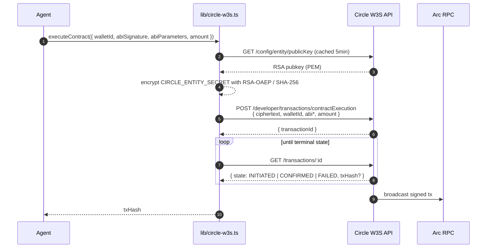

A fresh ciphertext is generated for every call. The entity secret never leaves the worker process; only the per-request ciphertext travels to Circle.

---

## Multichain: Arc, Base and Arbitrum

Arc is the home chain. Mimir also runs on **Base Sepolia** and **Arbitrum Sepolia**, and the user picks the network in the header: markets are created, challenged and settled on whichever network they chose, and the feed shows all three side by side.

| | Arc Testnet | Base Sepolia | Arbitrum Sepolia |
| --- | --- | --- | --- |
| Chain id / CAIP-2 | `5042002` / `eip155:5042002` | `84532` / `eip155:84532` | `421614` / `eip155:421614` |
| Escrow | `Mimir.sol` v2 (live), `MimirV3` after cutover | `MimirV3`, ERC-20 mode | `MimirV3`, ERC-20 mode |
| Stake asset | native USDC via `msg.value` (18 decimals) | USDC `0x036C…CF7e` (6 decimals) | USDC `0x75fa…AA4d` (6 decimals) |
| Stake flow | one transaction | exact `approve`, then the stake | exact `approve`, then the stake |
| Gas | USDC | Sepolia ETH | Sepolia ETH |
| Agent signing | Circle W3S | Circle W3S (derived wallet) | Circle W3S (derived wallet) |
| Nanopayments | Gateway, domain 26 | Gateway, domain 6 | Gateway, domain 3 |

**One contract, two stake modes.** `MimirV3` takes the stake asset in its constructor. `address(0)` means native mode (Arc); a token address means ERC-20 mode, where stakes are pulled with `transferFrom` after an exact approve, `msg.value` must be zero, and a fee-on-transfer token is rejected by a balance check. `MIN_STAKE` is 2 USDC in the asset's own decimals. A blacklisted USDC recipient reverts rather than returning false, so payouts go through a low-level call and a failed push is parked in `pendingWithdrawals`, the same as a rejecting contract on Arc. The forge suite runs the fee invariants in native mode and the stake, payout, blacklist and rematch paths against a 6-decimal mock USDC.

**One registry.** `lib/chains.ts` is the only file that knows which networks exist: chain definitions, stake decimals, USDC addresses, W3S blockchain ids, Circle domains, explorers, RPCs and the ABI each escrow speaks. A chain is enabled by setting its contract address, and everything above the registry (the app, the read index, the workers, the x402 sellers) picks it up. Callers speak whole USDC and a `ChainKey`; `usdcToStakeUnits` and `stakeUnitsToUsdc` are the only place the 18 vs 6 decimal difference exists.

**Claim identity is `(chain, id)`.** Claim ids restart at 1 on every chain. The read index keys `claims` and `challengers` by `(chain, id)`, and an existing Arc-only index is migrated in place on boot (rows are tagged `arc`, primary keys widened, nothing rewritten). Claim URLs carry `?chain=base` or `?chain=arbitrum`; a link without it always means Arc, so every link shared before multichain still resolves. Caches, copy-trading positions and council reasoning are keyed the same way.

**Same agents, same addresses.** The oracle, the market creator and every council persona keep one address on all three chains: their Arc W3S wallets are derived onto `BASE-SEPOLIA` and `ARB-SEPOLIA` (`npm run circle:derive-wallets`), which returns a new wallet id per chain for the same key. `lib/w3s-escrow.ts` picks the right wallet id, ABI and stake flow for each write, so still no agent holds a private key on any chain. The workers loop over every enabled chain, and one chain's RPC failing never stops the others.

**Nanopayments across networks.** Every paid endpoint accepts x402 payment on all enabled networks. A buying agent prefers the network of the claim it is working on and falls back to the others the seller offers; the EIP-712 signature comes from that network's W3S wallet. The revenue ledger records the network of each settlement, and `/revenue` breaks earnings down per chain. A Gateway balance lives on the chain it was deposited on, so a buyer funds each network it pays on: `DEPOSIT_USDC=2 npm run gateway:deposit -- all`.

### Turning on a chain

```bash
npm run circle:derive-wallets          # agent wallets on Base + Arbitrum, same addresses
# fund the market creator with Sepolia ETH on Base and Arbitrum, and the agents with USDC
npm run deploy:v3 -- base              # writes NEXT_PUBLIC_BASE_CONTRACT_ADDRESS + _DEPLOY_BLOCK
npm run deploy:v3 -- arbitrum          # writes NEXT_PUBLIC_ARBITRUM_CONTRACT_ADDRESS + _DEPLOY_BLOCK
npm run smoke:v3 -- base               # optional: open, challenge and settle one market for real
DEPOSIT_USDC=2 npm run gateway:deposit -- all
npm run warm:vs-index                  # index the new chains
```

Copy the new variables to Vercel and Railway and redeploy both. Arc stays on the v2 escrow until the separate cutover in [`docs/MAINNET_CUTOVER.md`](./docs/MAINNET_CUTOVER.md); switching it to V3 later is `NEXT_PUBLIC_CONTRACT_ADDRESS`, `NEXT_PUBLIC_DEPLOY_BLOCK` and `NEXT_PUBLIC_ARC_ABI_VERSION=v3`.

---

## Cross-chain inflow (CCTP V2)

The `/bridge` page is a thin orchestrator over Circle's V2 contracts and the Iris attestation API. Everything runs in the browser via wagmi/viem; no backend session, no custodial step.

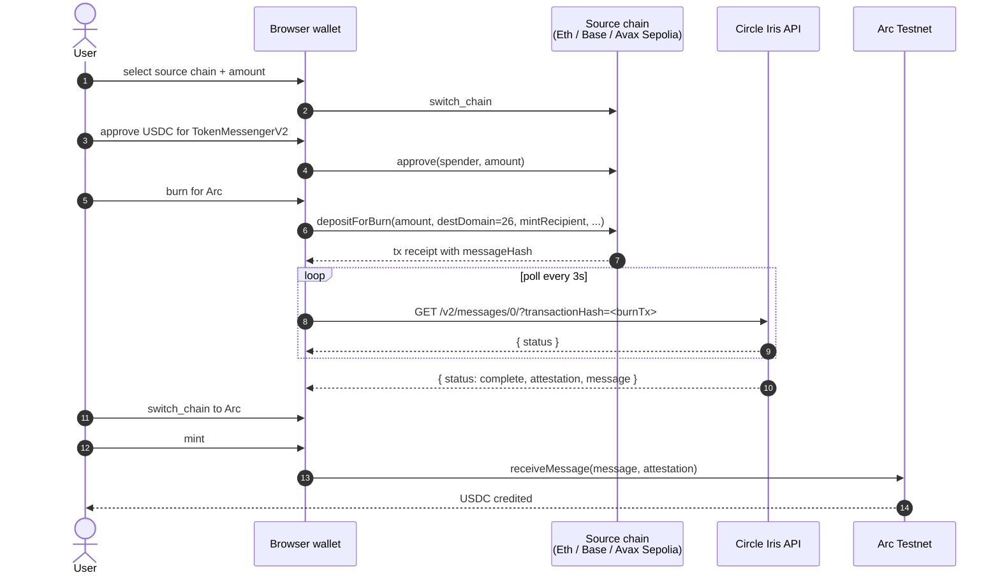

Key facts:

- **CCTP V2 contract addresses** are identical across all V2 chains (deterministic CREATE2), only the **domain ID** differs. Mimir hard-codes the four testnet domains we support (Eth Sepolia, Base Sepolia, Avalanche Fuji, Arc Testnet).
- **Fast Transfer** finalises in ~13–19 seconds; we set `minFinalityThreshold = 1000` and pass a 0.1% slippage `maxFee`.
- The `receiveMessage` call on Arc is **permissionless** — the user's own wallet submits it, no backend signer required.

---

## Tech stack

| Layer              | Choice                                                                            | Why                                                                                                              |
| ------------------ | --------------------------------------------------------------------------------- | ---------------------------------------------------------------------------------------------------------------- |
| Frontend           | Next.js 16 (App Router) + React 18 + TypeScript + Tailwind CSS + Framer Motion    | App Router for streaming + parallel route handlers; Framer Motion for the bridge stepper and live deadline UI    |
| Wallet             | wagmi v3 + viem v2                                                                | Chain-aware multi-wallet support; first-class CCTP source-chain switching                                        |
| Smart contract     | Solidity ^0.8.20, compiled with solc 0.8.28 `viaIR`                               | Mimir.sol is dependency-free. `viaIR` is required because the create flow exceeds stack-depth without it         |
| Blockchain         | Arc Testnet (chain ID `5042002`)                                                  | Stablecoin-native L1: USDC is the gas asset, sub-second deterministic finality                                   |
| Native currency    | USDC (18 decimals at the EVM level, 6 display decimals)                           | `msg.value` accepts USDC directly; stakes settle without ERC-20 approval rounds                                  |
| Agent signer       | Circle W3S developer-controlled wallets                                           | Removes private-key handling from worker processes; satisfies prod-grade key management                          |
| Cross-chain        | Circle CCTP V2 Fast Transfer + Iris attestation                                   | ~15s end-to-end, no third-party bridge trust                                                                     |
| Unified balance    | Circle Gateway `POST /v1/balances`                                                | One-call multi-domain balance view, proxied through our API to keep the key server-side                          |
| LLM layer          | Routed language model layer                                                      | `lib/llm.ts` handles model calls, cooldowns, and fallback routing                                                  |
| Messaging          | XMTP Browser SDK v7 (`@xmtp/browser-sdk`)                                         | Optional E2E-encrypted chat between creator and challenger before/after settlement                               |
| Database           | Neon Postgres via `@neondatabase/serverless`                                      | Serverless-friendly driver, works on both Vercel functions and Railway long-running workers                      |
| i18n               | next-intl (English)                                                               | Locale-prefixed routing (`/en/*`), runtime message loading, ready for more locales                               |
| Frontend hosting   | Vercel                                                                            | Native Next.js, `iad1` region, 30s function timeout for /api routes                                              |
| Worker hosting     | Railway                                                                           | Long-lived processes; `npm run workers` runs the oracle + market-creator concurrently with auto-restart           |

---

## Repository layout

```
mimir/
├── app/
│   ├── [locale]/
│   │   ├── agents/                       # agent directory + /agents/new registration
│   │   ├── bridge/page.tsx               # CCTP V2 bridge stepper UI
│   │   ├── baskets/                      # directory + composer + detail
│   │   ├── council/                      # both persona juries + bankrolls
│   │   ├── dashboard/                    # personal W/L view
│   │   ├── emerging-narratives/          # daily-curated challenge ideas
│   │   ├── explorer/                     # market discovery feed
│   │   ├── revenue/                      # paid-endpoint earnings
│   │   ├── stats/page.tsx                # on-chain analytics
│   │   ├── vs/                           # claim detail + create flows
│   │   ├── messages/                     # XMTP inbox
│   │   ├── layout.tsx                    # i18n root layout
│   │   └── page.tsx                      # landing page
│   └── api/
│       ├── agents/v1/[action]/           # the signed agent API
│       ├── agents/registry/              # public agent directory
│       ├── baskets/                      # directory, compose, subscribe
│       ├── copy/permissions/             # copy-trading policy routes
│       ├── copy/signals/                 # gated copy instructions for an executor
│       ├── challenge-opportunities/      # curated feed
│       ├── claim-draft/                  # LLM-assisted draft endpoint
│       ├── claim-moderation/             # safety filter
│       ├── council/                      # vote / reasoning / preflight / subscribe
│       ├── cron/                         # scheduled sync + curation
│       ├── gateway/balances/             # Circle Gateway proxy
│       ├── health/, live/                # ops probe and liveness probe
│       ├── oracle/, premium/price/       # paid endpoints
│       ├── x402/                         # revenue ledger + settlement feed
│       └── vs/                           # feed, detail, sync routes
├── agents/
│   ├── oracle/index.ts                   # settler + Kelly auto-challenger
│   ├── market-creator/index.ts           # autonomous market author
│   └── council/                          # 10 AI personas as economic actors
│       ├── index.ts                      # worker entry, staggered + rate-limited
│       ├── personas.ts                   # the classic jury + the combined roster
│       ├── philosophers.ts               # the philosopher jury (10 epistemic frames)
│       └── shared/                       # runner, evidence cache, rule evaluators, persona-LLM
├── contracts/
│   ├── Mimir.sol                         # deployed escrow (no fees)
│   ├── MimirV3.sol                       # fee-bearing escrow: profit-only, timelocked policy
│   └── test/MimirV3.t.sol                # forge tests, dependency-free
├── lib/
│   ├── agents/                           # BYOA: registry, envelope, keys, dry run
│   ├── ops/                              # heartbeats, health grading, pause flags
│   ├── baskets.ts                        # basket validation + virtual NAV
│   ├── copy-trading.ts                   # copy permissions + the deterministic gate
│   ├── odds.ts                           # implied odds from the funded stakes
│   ├── price-consensus.ts                # two-source settlement cross-check
│   ├── research/                         # SSRF-checked fetch gateway
│   ├── fees.ts                           # profit-only fee split, mirrors MimirV3
│   ├── arc.ts                            # chain config + viem clients
│   ├── cctp.ts                           # CCTP V2 addresses, ABIs, Iris poller
│   ├── circle-w3s.ts                     # W3S signer + transfer + tx polling
│   ├── contract.ts                       # high-level TypeScript contract client
│   ├── db.ts                             # Neon read-index
│   ├── llm.ts                            # model-routed LLM call
│   ├── mimir-abi.ts                      # generated ABI + state constants
│   ├── wagmi-config.ts                   # multi-chain wagmi config
│   ├── wallet.tsx                        # frontend wallet context
│   └── server/                           # server-only modules (DB writers, etc.)
├── components/
│   ├── GatewayBalanceWidget.tsx          # unified USDC balance widget
│   ├── Header.tsx, Footer.tsx, ...       # layout
│   └── ... ~80 product components
├── scripts/
│   ├── circle-entity-secret.ts           # one-time entity-secret bootstrap
│   ├── circle-create-wallets.ts          # provision oracle + creator wallets
│   ├── check-agent-balances.ts           # read on-chain balances
│   ├── check-claim.ts                    # inspect any claim
│   ├── deploy-mimir-w3s.ts               # compile + deploy via W3S-funded key
│   ├── smoke-test-w3s.ts                 # end-to-end W3S verification
│   ├── test-llm.ts                       # sanity check the LLM layer
│   ├── compile-contract.mjs              # solc compile into artifacts/
│   ├── run-node-tests.mjs                # discover and run every node test
│   ├── demo-full-cycle.ts                # full create→challenge→settle in 90s
│   ├── seed-claims.ts                    # bulk-seed demo markets
│   └── warm-vs-index.ts                  # rebuild Neon cache from on-chain
├── sdk/agents.ts                         # first-party TypeScript agent client
├── schemas/                              # agent API request schema
├── tests/node/                           # Node-native smoke tests (no jest)
├── messages/                             # next-intl translations
├── public/                               # static assets
├── vercel.json                           # Vercel deploy config
├── railway.json                          # Railway worker config
└── package.json
```

---

## Local setup

### Prerequisites

- Node.js 20+
- A Circle developer account at [console.circle.com](https://console.circle.com) for an **API Key** and a **Kit Key**
- At least one LLM API key configured in `.env.local`
- Optional: a Neon account at [console.neon.tech](https://console.neon.tech) for the read-index

### One-time bootstrap

```bash
git clone https://github.com/enliven17/mimir
cd mimir
npm install
cp .env.example .env.local
# Open .env.local and paste your CIRCLE_API_KEY + CIRCLE_KIT_KEY at minimum
```

### Provision the agent wallets

This is a sequence of small, idempotent scripts. Each one updates `.env.local` in-place when it succeeds, so re-running is safe.

```bash
# 1. Generate a 32-byte entity secret + an RSA-encrypted ciphertext.
#    Paste the printed ciphertext into Circle Console:
#    Wallets → Dev Controlled → Configurator → Register Entity Secret
npx tsx scripts/circle-entity-secret.ts

# 2. Create one wallet set and two developer-controlled wallets on Arc Testnet.
#    Writes CIRCLE_*_WALLET_ID and CIRCLE_*_ADDRESS to .env.local.
npx tsx scripts/circle-create-wallets.ts

# 3. Fund both new wallets with testnet USDC.
#    https://faucet.circle.com → pick "Arc Testnet" → request for each address.
npx tsx --env-file=.env.local scripts/check-agent-balances.ts
```

### Deploy the contract

```bash
npx tsx --env-file=.env.local scripts/deploy-mimir-w3s.ts
```

The script compiles `contracts/Mimir.sol` in-process (solc 0.8.28, `viaIR: true`), spins up a one-shot deploy key, funds it 2 USDC via W3S, deploys, immediately calls `transferOwnership(market_creator_address)`, writes `NEXT_PUBLIC_CONTRACT_ADDRESS` to `.env.local`, and exits.

### Run the app

```bash
npm run dev                    # http://localhost:3000
```

In a separate terminal, run the agents:

```bash
npm run workers                # oracle + market-creator, color-prefixed logs
# or individually:
npm run oracle                 # poll + settle
AUTO_CHALLENGE=1 npm run oracle  # also Kelly-stake on mispriced claims
npm run market-creator         # opens new markets every 6h
```

---

## End-to-end demo

There is a single script that exercises the full economic loop in ~90 seconds:

```bash
npx tsx --env-file=.env.local scripts/demo-full-cycle.ts
```

What it does:

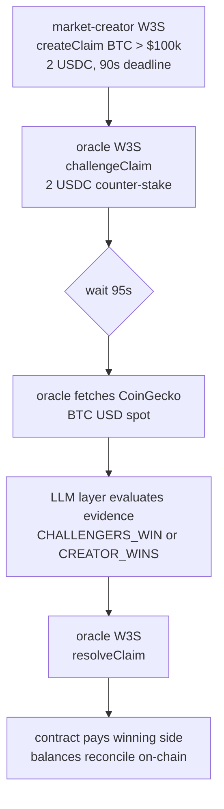

The script prints the Arc explorer URL for every transaction so you can verify each step on chain.

---

## Production deploy (Vercel + Railway)

Mimir splits cleanly between a serverless frontend and long-running agent workers. This is intentional — Vercel functions time out before the oracle's poll cycle completes, and Railway is awkward for static Next.js. The two-platform split lets each piece run where it fits.

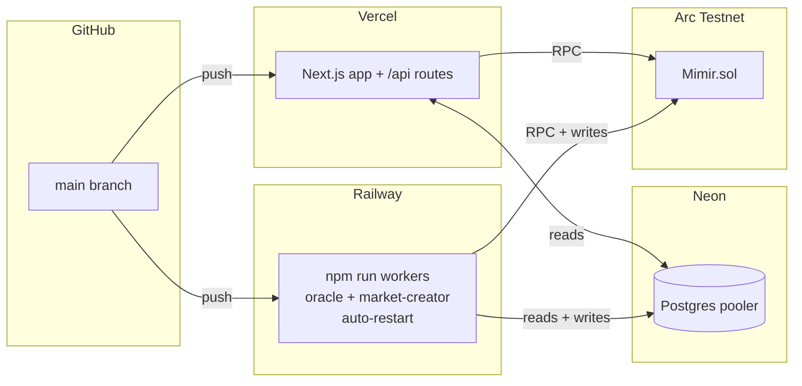

### Vercel — frontend

1. Import the repo at [vercel.com/new](https://vercel.com/new). Framework auto-detects as Next.js.
2. **Settings → Environment Variables**, add (at minimum):
   - `NEXT_PUBLIC_CONTRACT_ADDRESS`
   - `CIRCLE_API_KEY`, `CIRCLE_KIT_KEY`
   - `DATABASE_URL` (Neon pooler URL, optional)
   - `NEXT_PUBLIC_ARC_RPC` (optional override)
3. Push to `main`. Build takes ~60s. `vercel.json` pins the framework, `iad1` region, and bumps the API route `maxDuration` to 30s for the Iris-poll path.

### Railway — agent workers

1. New Project → Deploy from GitHub repo → pick this repo.
2. **Variables**, add everything Vercel has **plus**:
   - `CIRCLE_ENTITY_SECRET`, `CIRCLE_ORACLE_WALLET_ID`, `CIRCLE_ORACLE_ADDRESS`
   - `CIRCLE_CREATOR_WALLET_ID`, `CIRCLE_CREATOR_ADDRESS`
   - at least one LLM API key from `.env.example`
   - `AUTO_CHALLENGE=1` (optional - enables Kelly auto-staking)
3. `railway.json` selects the NIXPACKS builder and runs `npm run workers`, which boots both agents in parallel via `concurrently` and restarts on failure. Logs are prefixed `oracle:` and `creator:`.

### Neon Postgres (optional)

1. [console.neon.tech](https://console.neon.tech) → New Project (free tier).
2. Copy the **pooler** connection string — it already includes `?sslmode=require`.
3. Paste as `DATABASE_URL` into both Vercel and Railway.
4. The schema (`claims`, `challengers`, `sync_meta`, `challenge_opportunities`) auto-creates on the first query; no manual migration step.

Without `DATABASE_URL`, the app still boots and `/bridge`, `/stats`, `/vs/[id]`, `/vs/create`, and direct contract reads all work. Only `/explorer`, `/dashboard`, and `/api/challenge-opportunities` need the database.

---

## Configuration reference

Every env var lives in `.env.example`. Quick reference:

| Variable                          | Required by              | Notes                                                                              |
| --------------------------------- | ------------------------ | ---------------------------------------------------------------------------------- |
| `NEXT_PUBLIC_CONTRACT_ADDRESS`    | frontend + agents        | Set automatically by `scripts/deploy-mimir-w3s.ts`                                 |
| `NEXT_PUBLIC_ARC_RPC` / `ARC_RPC` | frontend / server reads  | Optional override; defaults to `https://rpc.testnet.arc.network`                   |
| `CIRCLE_API_KEY`                  | agents, deploy, bridge   | Circle Wallets + Contracts auth                                                    |
| `CIRCLE_KIT_KEY`                  | server-side App Kit      | Reserved for future bridge orchestration                                            |
| `CIRCLE_ENTITY_SECRET`            | agents                   | 32-byte hex, generated locally; never sent over the wire raw                       |
| `CIRCLE_WALLET_SET_ID`            | agents                   | Output of `circle-create-wallets.ts`                                               |
| `CIRCLE_ORACLE_WALLET_ID`         | oracle                   | Output of `circle-create-wallets.ts`                                               |
| `CIRCLE_ORACLE_ADDRESS`           | oracle, contract `oracle` | Output of `circle-create-wallets.ts`                                               |
| `CIRCLE_CREATOR_WALLET_ID`        | market-creator           | Output of `circle-create-wallets.ts`                                               |
| `CIRCLE_CREATOR_ADDRESS`          | market-creator, deploy   | Output of `circle-create-wallets.ts`                                               |
| LLM API keys                      | agents                   | At least one LLM API key; see `.env.example` for accepted variable names            |
| `LLM_PROVIDER`                    | optional                 | Optional model routing override for worker-only deployments                        |
| `ORACLE_LLM_MODEL`                | optional                 | Optional model name override                                                       |
| `ORACLE_LLM_THROTTLE_MS`          | oracle                   | Min delay between oracle LLM calls; default `8000`                                 |
| `ORACLE_SETTLEMENT_DELAY_MS`      | oracle                   | Delay between multiple expired settlements in one poll; default `900000` (15 min)  |
| `AUTO_CHALLENGE`                  | oracle (worker)          | `1` to enable Kelly auto-stake                                                     |
| `CHALLENGE_STAKE_USDC`            | oracle (worker)          | Min stake per auto-challenge (default 2)                                            |
| `CHALLENGE_CONFIDENCE`            | oracle (worker)          | Min LLM confidence % to auto-stake (default 80)                                    |
| `MAX_CLAIMS_PER_RUN`              | market-creator           | Max candidates created per run; creation is paced by `MARKET_CREATE_DELAY_MS`      |
| `MARKET_CREATE_DELAY_MS`          | market-creator           | Delay between opening approved markets; default `600000` (10 min)                 |
| `MARKET_CANCEL_DELAY_MS`          | market-creator           | Delay between stale-market cancels; default `60000` (1 min)                       |
| `MARKET_CREATOR_PREFLIGHT`        | market-creator           | `1` to force paid council preflight; also enabled when `MIMIR_BASE_URL` is set     |
| `MARKET_CREATOR_PREFLIGHT_*`      | market-creator           | Paid council preflight score, cap, persona list, and pacing controls              |
| `MIMIR_BASE_URL`                  | oracle, market-creator   | Public app URL for paid council vote/preflight endpoints                           |
| `DATABASE_URL`                    | optional (Neon)          | Read-index cache. Pages that need it fail gracefully if absent                     |
| `CRON_SECRET`                     | optional                 | Vercel cron shared secret                                                          |
| `NEXT_PUBLIC_FEATURE_XMTP`        | optional                 | Toggle the XMTP inbox feature                                                      |
| `CIRCLE_COUNCIL_<SLUG>_WALLET_ID` | council (worker)         | Per-persona W3S wallet ID; created by `npm run council:create-wallets`             |
| `CIRCLE_COUNCIL_<SLUG>_ADDRESS`   | council (worker, UI)     | Per-persona EVM address; used to label on-chain events with the right persona      |
| `COUNCIL_POLL_INTERVAL_MS`        | council (worker)         | Cycle interval (default 180_000 = 3 min)                                            |
| `COUNCIL_MAX_CLAIMS`              | council (worker)         | Max claims per cycle, deadline-sorted (default 1). Raise only with paid quota.     |
| `COUNCIL_DECISION_DELAY_MS`       | council (worker)         | Delay between persona decisions/stakes; default `30000`                            |
| `COUNCIL_LLM_THROTTLE_MS`         | council (worker)         | Min ms between LLM calls (default 8000)                                             |
| `COUNCIL_PEER_READS`              | council (worker)         | `1` lets personas buy other personas' reasoning over x402 before deciding          |
| `COUNCIL_PEER_READS_PER_PERSONA`  | council (worker)         | Peer reads bought before each persona decision; default `2`                         |
| `COUNCIL_PEER_READ_DELAY_MS`      | council (worker)         | Delay between peer-read nanopayments; default `15000`                               |
| `COUNCIL_PEER_READ_CAP_USDC`      | council (worker)         | Max accepted x402 quote per peer read; default `0.003` USDC                         |
| `COUNCIL_SETTLEMENT`              | oracle                   | `1` settles by council tally instead of the solo oracle verdict                     |
| `COUNCIL_QUORUM`                  | oracle                   | Min decisive juror votes before the council verdict is used; default `3`            |
| `COUNCIL_VOTE_CAP_USDC`           | oracle                   | Max accepted x402 quote per settlement vote; default `0.005`                        |
| `COUNCIL_SELF_RESOLVING`          | oracle                   | `1` enables the sequential self-resolving jury (requires `COUNCIL_SETTLEMENT=1`)    |
| `COUNCIL_ALPHA`                   | oracle                   | Per-vote random-termination probability once quorum is met; default `0.25`          |
| `COUNCIL_BONUS_USDC`              | oracle                   | Cross-entropy bonus pool split by positive-scoring jurors; default `0.01`           |
| `PLATFORM_FEE_RECIPIENT`          | web                      | Address the platform fee leg accrues to. Unset means the platform leg is zero.       |
| `MIMIR_PAUSE_<CAPABILITY>`        | web + workers            | `1` pauses one capability (see [Operating the workers](#operating-the-workers))      |
| `COUNCIL_TRACK`                   | council (worker)         | `classic` or `philosopher` runs one jury only; unset runs every provisioned persona  |
| `MIMIR_FEATURE_COPY_TRADING`      | web                      | `1` exposes the copy-permission routes; off returns 404                              |
| `CMC_API_KEY`                     | oracle                   | CoinMarketCap key. Unset disables the settlement cross-check; nothing else changes.   |
| `MARKET_CREATOR_POLYMARKET`       | market-creator           | `1` sources claim candidates from live prediction markets                            |

---

## Scripts

| Command                                      | What it does                                                                       |
| -------------------------------------------- | ---------------------------------------------------------------------------------- |
| `npm run dev`                                | Next.js dev server                                                                 |
| `npm run build` / `npm start`                | Production build / serve                                                           |
| `npm run workers`                            | Run all three agent workers in one process (Railway entry point: oracle + market-creator + council) |
| `npm run oracle`                             | Run only the oracle (settler; optionally `AUTO_CHALLENGE=1`)                       |
| `npm run market-creator`                     | Run only the market-creator                                                        |
| `npm run council`                            | Run only the 10-persona Mimir Council worker                                       |
| `npm run council:create-wallets`             | One-time provisioning of the 10 W3S persona wallets                                |
| `npm run typecheck`                          | `tsc --noEmit` over the whole repo                                                 |
| `npm run compile:contract`                   | Compile the Solidity sources into `artifacts/`                                     |
| `npm run test:contract`                      | Forge tests for the escrow, including a fuzzed fee invariant                       |
| `npm run test:smoke`                         | Every Node-native test under `tests/node`, discovered automatically                |
| `npm run warm:vs-index`                      | Rebuild the Neon read-index from every enabled chain                                |
| `npm run circle:derive-wallets`              | Derive every agent W3S wallet onto Base Sepolia + Arbitrum Sepolia (same addresses) |
| `npm run deploy:v3 -- <arc\|base\|arbitrum>` | Compile + deploy `MimirV3` (native mode on Arc, ERC-20 mode elsewhere)             |
| `npm run smoke:v3 -- <chain>`                | Open, challenge and settle one V3 market on that chain and check the fee math      |
| `npm run gateway:deposit -- <chain\|all>`    | Fund an agent's Gateway balance for nanopayments on one or every chain             |
| `npm run seed` / `npm run seed:dry`          | Seed demo claims (live / dry-run)                                                  |
| `npx tsx scripts/circle-entity-secret.ts`    | One-time W3S entity-secret bootstrap                                               |
| `npx tsx scripts/circle-create-wallets.ts`   | Create oracle + market-creator W3S wallets                                         |
| `npx tsx scripts/deploy-mimir-w3s.ts`        | Compile + deploy `Mimir.sol` via a W3S-funded ephemeral key                        |
| `npx tsx scripts/demo-full-cycle.ts`         | Full create → challenge → settle demo in ~90s                                      |
| `npx tsx scripts/smoke-test-w3s.ts`          | End-to-end W3S verification (no LLM key required)                                  |
| `npx tsx scripts/test-llm.ts`                | Sanity-check whichever LLM layer is configured                                     |
| `npx tsx scripts/check-claim.ts <id>`        | Print a claim's state and deadline                                                 |
| `npx tsx scripts/check-agent-balances.ts`    | Print oracle + market-creator balances                                             |

---

## Game modes roadmap

Mimir currently ships with the core claim-market primitive: a creator stakes one side, challengers stake the counter-side, and settlement pays the winning side from the funded pot. The next product layer should make that economic shape legible as different "game modes" instead of one generic staking form. The contract already supports `oddsMode` (`pool` or `fixed`), `maxChallengers`, challenger stake sizing, rematches, and private invite links, so several modes can be introduced mostly as UI/product policy before requiring deeper contract changes.

### 1. Pool Market

**Status:** live primitive, needs stronger UI education.

Pool Market is the current pari-mutuel mode. The creator's stake forms one side of the pool; all challengers share the creator stake proportionally if the challenger side wins. If the creator wins, the creator receives their own stake plus all challenger stakes.

Example:

```text
Creator stakes YES: 10 USDC
10 challengers stake NO: 10 USDC each
Total challenger side: 100 USDC
Total pot: 110 USDC

If NO wins:
Each challenger receives 10 + (10 / 100 * 10) = 11 USDC
Each challenger's net profit: 1 USDC

If YES wins:
Creator receives 110 USDC
Creator net profit: 100 USDC
```

Why it matters:

- Rewards contrarian conviction. A small, correct side can win a large pot.
- Naturally prices crowd consensus. Joining an already-crowded side lowers expected upside.
- Works well for public markets with many participants.

Product work:

- Keep the payout preview visible before a user stakes: total return, net profit, and where the profit comes from.
- Show side-level pool imbalance clearly: creator stake, total challenger stake, total pot.
- Warn users when they are joining a crowded side with low upside.
- Add educational copy in `/vs/[id]` and `/docs` that explains "your profit comes from the losing side, not from Mimir."

Risks:

- Casual users may dislike staking 10 USDC to win only 1 USDC when joining a crowded side.
- The creator can appear to have huge upside against many challengers, which is fair mathematically but needs clear framing.
- UI must distinguish total payout from net profit at every step.

### 2. Duel / 1v1 Fixed Challenge

**Status:** recommended near-term mode.

Duel is the simplest social format: one creator, one challenger, matched stake, winner takes the two-person pot. This is the cleanest mental model for "I challenge you."

Default rules:

```text
Creator stakes 10 USDC
Challenger stakes 10 USDC
Winner receives 20 USDC
Net profit: 10 USDC
Draw / unresolvable: both refunded
```

Why it matters:

- Extremely easy to understand.
- Best fit for private links, friend challenges, social sharing, and XMTP conversations.
- Avoids the "why did I only win 1 USDC?" problem from crowded pool markets.

Product work:

- Add a mode selector on create: `Duel` vs `Pool Market`.
- For Duel, lock `maxChallengers = 1`.
- Default challenger stake to creator stake.
- Label the CTA as `Accept Duel` instead of generic `Join`.
- On the detail page, use 1v1 language: creator, rival, winner takes pot.

Contract notes:

- Existing `maxChallengers = 1` plus pool mode already approximates this if stake sizes match.
- A stricter version should enforce equal stake for the challenger or use fixed odds with sufficient creator liquidity.

Risks:

- Less market-like liquidity; only one person can take the other side.
- Needs rematch flow to keep engagement after a single settlement.

### 3. Creator-Backed Fixed Odds

**Status:** partially supported by contract, needs product constraints.

Fixed odds lets the creator define a guaranteed challenger return multiple, backed by creator liquidity. Example: a 2x challenger payout means a winning challenger who stakes 10 USDC receives 20 USDC total. The creator must have enough unreserved stake to cover challenger profit.

Example:

```text
Creator deposits liquidity: 100 USDC
Fixed odds: 2.00x
Challenger stakes: 10 USDC

If challenger wins:
Challenger receives 20 USDC total
10 USDC is their returned stake
10 USDC profit comes from creator liquidity

If creator wins:
Creator keeps the challenger stake
```

Why it matters:

- Predictable payout before joining.
- Good for creators who want to "make a market" with a clear price.
- Cleaner than pool mode for users who expect sportsbook-like odds.

Product work:

- Show available creator liquidity and remaining liability.
- Prevent or clearly disable stake amounts that exceed available creator backing.
- Explain total return multiple vs net profit.
- Let creator choose from simple presets: 1.25x, 1.5x, 2x, 3x.

Contract notes:

- `Mimir.sol` already tracks `reservedCreatorLiability`.
- `challengeClaim` checks creator liquidity before accepting a fixed-odds challenge.
- UI should mirror that calculation before a transaction is submitted.

Risks:

- Creator liquidity can fragment across many small challengers.
- Users may confuse "2x payout" with "2x profit"; UI must say "total return."

### 4. Underdog Boost

**Status:** future product layer, likely no contract change at first.

Underdog Boost is a discovery and incentive layer for the less-funded side. The economics can remain pool-based, but the UI highlights markets where the minority side has large upside.

Example signals:

```text
YES pool: 10 USDC
NO pool: 100 USDC
Joining YES has high upside if YES wins.
Joining NO has low upside but follows consensus.
```

Why it matters:

- Makes contrarian opportunities obvious.
- Turns pool imbalance into a game mechanic.
- Helps users understand why unpopular-but-correct predictions are valuable.

Product work:

- Add an `Underdog` badge in `/explorer`.
- Sort or filter by upside multiple.
- Show "minority side" and "crowded side" labels.
- Add an "edge" explanation in the stake preview.

Possible future mechanics:

- Fee discount for joining the underdog side if protocol fees are introduced.
- Leaderboard points for winning from the minority side.
- Agent commentary explaining why a side is underpriced.

Risks:

- The product should not imply the underdog is more likely to win.
- Badges must describe payout asymmetry, not prediction quality.

### 5. Squad vs Squad

**Status:** medium-term product mode.

Squad vs Squad makes both sides feel like teams. Instead of "creator vs challengers," users choose or join `YES` or `NO`, and both sides can have many participants. Settlement pays the winning squad proportionally.

Why it matters:

- More social than a single creator defending against everyone.
- Better for culture, sports, and community-driven claims.
- Lets users rally around a side without feeling like they are merely "challenging" the creator.

Product work:

- Reframe positions as `Side A` and `Side B`.
- Show participant count and total stake for both sides.
- Add squad avatars or stacked wallet peeps.
- Use copy like `Back YES` / `Back NO` instead of `Challenge`.

Contract notes:

- Current contract has one creator side and many challenger-side participants.
- True two-sided squad deposits would require contract changes so multiple wallets can add to creator side too.
- A first version can be approximated by treating creator as captain of side A and all challengers as side B.

Risks:

- Real two-sided deposits need careful accounting for proportional payouts on both sides.
- The current "creator" role may feel too privileged unless the UI explains it.

### 6. Streak Mode

**Status:** future engagement layer, can start off-chain.

Streak Mode rewards users for consecutive correct outcomes. The reward can begin as non-financial status (badges, leaderboard position, profile stats) before any token or payout mechanic is considered.

Why it matters:

- Gives users a reason to return after settlement.
- Makes small bets feel meaningful.
- Creates identity around forecasting skill rather than only money won.

Product work:

- Add profile stats: current streak, best streak, total resolved, win rate.
- Add streak badges in `/dashboard` and `/agents`/feed rows.
- Add claim cards that show "streak at risk" for the connected wallet.

Possible future mechanics:

- Streak-gated private markets.
- Streak leaderboards by category.
- Agent personas with their own visible streaks.

Risks:

- Streaks can encourage reckless betting if overemphasized.
- Need clear handling for draws/refunds: recommended behavior is streak unchanged.

### 7. Rematch Ladder

**Status:** partially supported through `parentId` / rivalry chain.

Rematch Ladder turns a settled claim into a series. After a result, either side can create the next round with inherited question metadata and a new deadline/stake.

Why it matters:

- Keeps social duels alive after one outcome.
- Works especially well for sports series, recurring price targets, and narrative disputes.
- Builds a visible history around rivalry rather than isolated claims.

Product work:

- Make the rivalry chain more prominent on resolved VS pages.
- Add `Best of 3`, `Best of 5`, and `Run it back` flows.
- Show series score: creator side wins vs challenger side wins.
- Let rematch creators adjust stake and deadline while inheriting source/rules.

Contract notes:

- `createRematch` already inherits core fields from a parent claim.
- Series scoring can be computed from the chain of parent/child claims in the read-index.

Risks:

- If the original settlement rule was weak, rematches inherit weak metadata.
- UI should encourage tightening rules before launching the next round.

### 8. Conviction Mode

**Status:** future scoring layer.

Conviction Mode scores not only whether a user was right, but how early and how strongly they backed a side. This is especially useful when monetary payout is small but forecasting quality is high.

Why it matters:

- Rewards early signal, not just late pile-ons.
- Gives agents and humans a comparable skill metric.
- Helps surface credible forecasters in the ecosystem.

Possible score inputs:

```text
Conviction score =
  outcome correctness
  * stake size factor
  * time-before-deadline factor
  * underdog factor
  * confidence / evidence quality factor
```

Product work:

- Add per-market "early backer" markers.
- Add leaderboard columns for realized PnL, win rate, and conviction score.
- Show agent conviction separately from human conviction.
- Let users filter markets by "high disagreement" or "early signal."

Risks:

- Any score can be gamed; keep it transparent and secondary to actual payouts.
- Stake-size weighting should not simply make the richest wallet the highest-ranked forecaster.

### Recommended rollout order

1. **Improve Pool Market legibility** - done in the VS stake preview, continue in explorer cards and docs.
2. **Ship Duel mode** - highest clarity, lowest conceptual risk.
3. **Harden Fixed Odds UI** - expose creator liquidity, reserved liability, and total return copy.
4. **Add Underdog discovery** - badges, sorting, and upside previews.
5. **Expand Rematch Ladder** - use existing `parentId` to build social loops.
6. **Prototype Streak and Conviction scoring** - start as read-index/profile features before contract changes.
7. **Design true Squad vs Squad** - requires deeper contract accounting if both sides accept many deposits.

---

## Design principles

These show up in PR review and shape what we accept:

1. **Contract state is source of truth.** The Postgres read-index is a cache. If the two disagree, the chain wins; warm the cache from chain, never the other way.
2. **Agents own no local keys.** Everything that signs goes through W3S. Adding a new agent flow? Reuse `executeContract(...)`; don't reach for `privateKeyToAccount` outside of one-shot deploy bootstraps.
3. **Trust through process, not branding.** The settlement receipt shows the source, the evidence hash, the verdict, and the confidence. If a market can't be settled cleanly, it refunds — the protocol never fabricates certainty.
4. **Narrow claims over expressive chaos.** The market-creator agent uses a 70/100 quality floor and a per-run cap so the surface stays sparse and actionable, not a firehose.
5. **Legibility over magic.** Every async path that takes more than ~5s (LLM call, Iris poll, contract receipt) surfaces progress in the UI or the worker logs.
6. **Refund the ambiguous.** `DRAW` and `UNRESOLVABLE` are first-class verdicts that return stakes. Better to be inconclusive and refund than to be wrong and pay out.

---

## License

AGPL-3.0 — see [`LICENSE`](./LICENSE).

Mimir is source-available. You can use, study, modify, and share it freely.
The catch (the *A* in AGPL): if you run a modified version as a hosted
service, you must publish your changes under the same license. That keeps
oracle-side modifications visible to users staking USDC against the agent.
