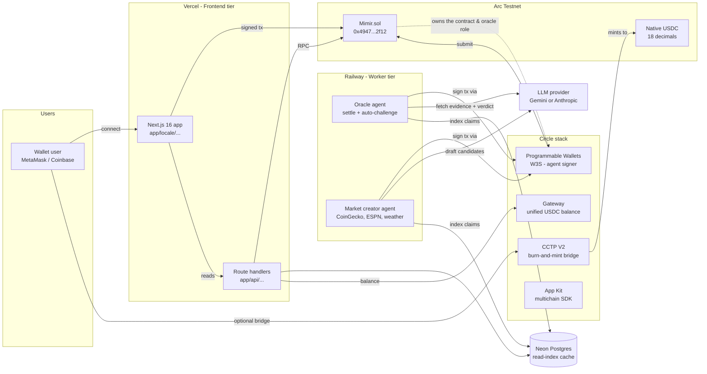
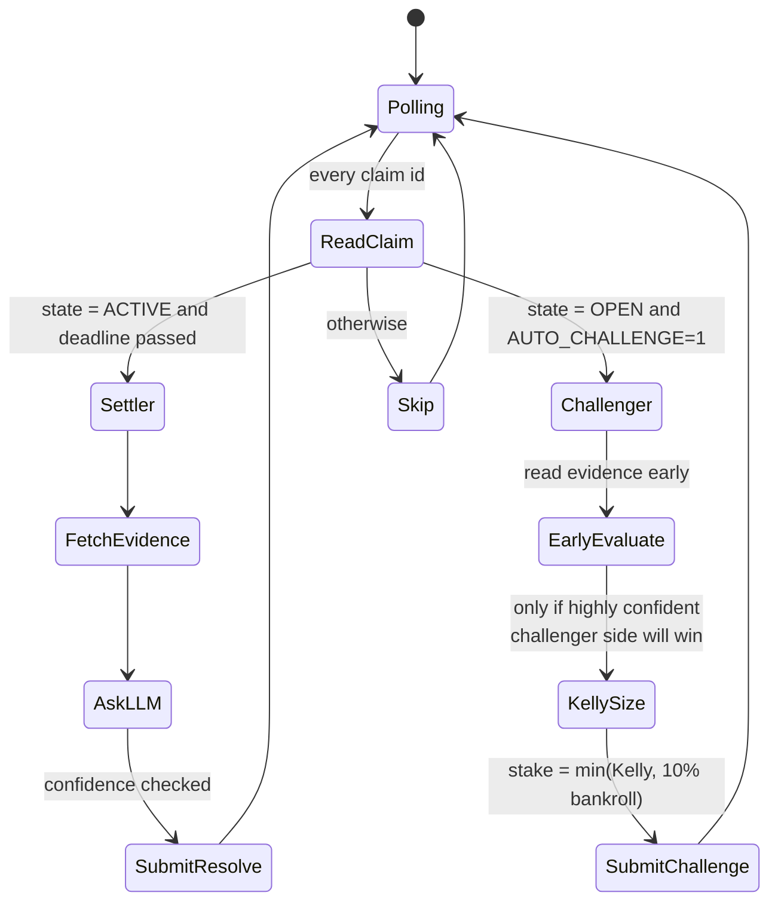
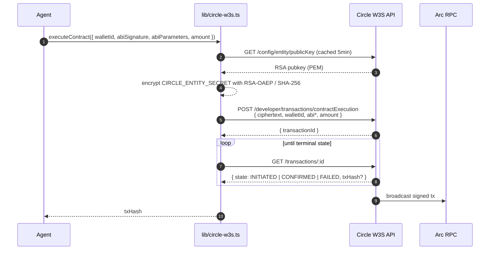
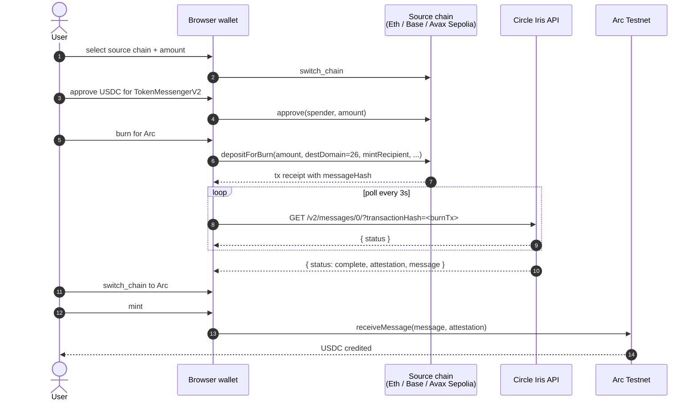
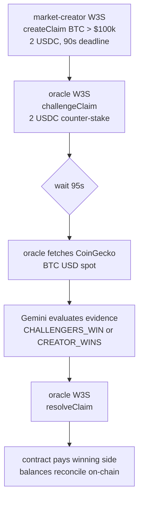
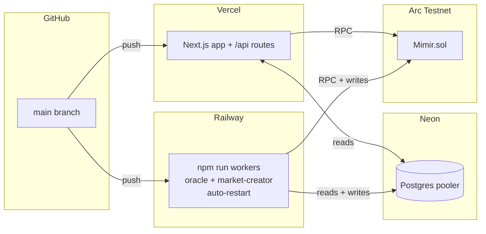

# Mimir

**An AI-settled claim market on [Arc](https://arc.network) — Circle's stablecoin-native L1.**

> *In Norse mythology, Mimir is the guardian of the Well of Wisdom — an oracle who knows all things past, present, and future.*

Mimir is a peer-to-peer market for public claims about future outcomes. Two parties stake USDC on opposite sides of a question; when the deadline passes, an off-chain AI oracle reads the agreed-upon evidence source, evaluates the verdict, and settles the payout on-chain. Every step — staking, challenging, resolution, payout — happens in native USDC with sub-second finality and predictable, sub-cent fees.

The agents that run Mimir do not hold private keys. They sign every transaction through Circle's Programmable Wallets (W3S), use Circle's CCTP V2 to bridge USDC into Arc from any supported chain, and surface a unified balance via Circle Gateway. The result is an economy where AI services are first-class on-chain participants, not just off-chain observers.

---

## Table of contents

- [What it does](#what-it-does)
- [Architecture](#architecture)
- [The settlement lifecycle](#the-settlement-lifecycle)
- [Agents as economic actors](#agents-as-economic-actors)
- [Circle stack integration](#circle-stack-integration)
- [Cross-chain inflow (CCTP V2)](#cross-chain-inflow-cctp-v2)
- [Tech stack](#tech-stack)
- [Repository layout](#repository-layout)
- [Local setup](#local-setup)
- [End-to-end demo](#end-to-end-demo)
- [Production deploy (Vercel + Railway)](#production-deploy-vercel--railway)
- [Configuration reference](#configuration-reference)
- [Scripts](#scripts)
- [Design principles](#design-principles)

---

## What it does

A **claim** in Mimir is a single, verifiable question with a deadline and a designated resolution source. For example:

> *"Will BTC close above $100,000 USD on 2026-05-25 according to CoinGecko?"*

Anyone can create a claim, stake USDC on one side, and publish it. Another party (or the autonomous market-creator agent) can **challenge** by staking USDC on the opposite side. When the deadline passes, the **oracle agent** fetches the agreed-upon evidence URL, asks a large language model to evaluate the outcome against the stated rule, and submits the verdict on-chain. The smart contract then atomically pays out the winning side.

There are no judges, no committees, no manual disputes. The product surfaces are:

| Page                                 | Purpose                                                                            |
| ------------------------------------ | ---------------------------------------------------------------------------------- |
| `/`                                  | Marketing surface — what Mimir is, live stats, recent settlements                  |
| `/explorer`                          | Claim feed with Open / AI signals / Closed tabs and category + stake filters       |
| `/vs/[id]`                           | Claim detail — pool sizes, challengers, settlement receipt with confidence tier     |
| `/vs/create`                         | Author flow — claim drafting with AI-assisted resolution metadata                  |
| `/dashboard`                         | Per-wallet view — your claims, your payouts, your W/L record                       |
| `/bridge`                            | Pull USDC into Arc from any CCTP V2 chain in ~15s                                  |
| `/stats`                             | Real-time on-chain analytics: total volume, accuracy %, refund rate, agent vault   |
| `/agents`                            | Live activity log for the oracle + market-creator (every on-chain action they take) |
| `/docs`                              | Long-form architecture + how-it-works writeup with custom diagrams                  |
| `/emerging-narratives`               | Daily-curated "challenge-ready" opportunities (human-lite curation)                |

---

## Architecture



The diagram shows three independent runtime tiers:

1. **Frontend tier (Vercel)** — Next.js App Router with API routes. Pure read paths talk to Arc RPC directly; writes are user-signed via wagmi/viem.
2. **Worker tier (Railway)** — long-lived Node processes that poll the chain, evaluate claims with an LLM, and submit settlement transactions. They sign via W3S, never with a local private key.
3. **Data tier (Neon Postgres)** — a denormalised read-index of the on-chain state. Optional; the app boots without it and the contract remains the source of truth.

---

## The settlement lifecycle


Several details matter for trust:

- **`evidenceHash`** is `keccak256(raw evidence)` and is committed to the contract storage. Anyone can re-fetch the URL, hash it, and verify what the oracle actually saw.
- **`confidence`** is exposed on-chain. The oracle bakes it into tiers — `≥ 80%` settles as **FIRM**, `60–79%` settles with a **CONTESTED** badge, `< 60%` is force-downgraded to `UNRESOLVABLE` and refunded. The Settlement Receipt UI surfaces the tier explicitly.
- **`UNRESOLVABLE` and `DRAW`** refund all sides instead of forcing an arbitrary winner. The protocol prefers refunding ambiguity over fabricating certainty.
- **Challenge lock window.** `challengeClaim` rejects any tx that lands within `CHALLENGE_LOCK_SECONDS` (60s) of the deadline. Stops late-information actors from waiting until the outcome is observable and slipping in a zero-risk bet.
- **Only the configured `oracle` address** can call `resolveClaim`. That address is a Circle-managed wallet — no human can quietly re-route it.

---

## Agents as economic actors

Two background agents run continuously. Both sign transactions through W3S; neither holds a local private key.

### Oracle agent (`agents/oracle/index.ts`)

A poll loop every 60 seconds. Two roles:



- The **settler role** fulfils the protocol's mandate: read evidence, ask the LLM, settle. Pure on-chain side-effect.
- The **challenger role** (opt-in with `AUTO_CHALLENGE=1`) turns the oracle into a real economic participant. It uses the [Kelly criterion](https://en.wikipedia.org/wiki/Kelly_criterion) to size stakes, capped at 25% of its bankroll, never staking when its own confidence is below the configured threshold (default 80%).

### Market-creator agent (`agents/market-creator/index.ts`)

Runs every 6 hours. Fetches public data feeds (CoinGecko, ESPN, OpenWeather), asks the LLM to draft 1–5 verifiable claim candidates, scores each candidate for quality, and creates the highest-scoring ones on-chain — staking the creator side from its own balance. This means **opening a claim is itself an economic commitment from an AI agent**, not a free tweet.

The agent treats curation as the scarce resource. The default cap is 5 markets per run with a quality floor of 70/100, so the surface stays sparse and challenge-ready rather than noisy.

---

## Circle stack integration

| Piece                          | Where it lives                                                                | What it actually does in Mimir                                                                                       |
| ------------------------------ | ----------------------------------------------------------------------------- | -------------------------------------------------------------------------------------------------------------------- |
| **USDC** as native token       | `contracts/Mimir.sol`, `lib/arc.ts`                                           | Stakes use `msg.value` — no ERC-20 approval flow, no allowance dance, ~$0.01 per call                                |
| **Programmable Wallets (W3S)** | `lib/circle-w3s.ts`, both agent entry points                                  | Oracle + market-creator wallets are Circle-managed. Every contract execution goes through `executeContract(...)`     |
| **CCTP V2 (Fast Transfer)**    | `lib/cctp.ts`, `app/[locale]/bridge/page.tsx`                                 | Browser-driven burn-and-mint bridge from Eth/Base/Avalanche Sepolia into Arc in ~15s                                 |
| **Gateway**                    | `app/api/gateway/balances/route.ts`, `components/GatewayBalanceWidget.tsx`    | Server-side proxy returns the user's unified USDC balance across every CCTP V2 domain in one round-trip              |
| **App Kit / Swap Kit** (key)   | reserved via `CIRCLE_KIT_KEY` for future server-side bridge orchestration     | The CCTP path currently runs entirely on-chain via viem; App Kit hooks in if/when we want server-funded sponsorship  |

### W3S transaction submission



A fresh ciphertext is generated for every call. The entity secret never leaves the worker process; only the per-request ciphertext travels to Circle.

---

## Cross-chain inflow (CCTP V2)

The `/bridge` page is a thin orchestrator over Circle's V2 contracts and the Iris attestation API. Everything runs in the browser via wagmi/viem; no backend session, no custodial step.



Key facts:

- **CCTP V2 contract addresses** are identical across all V2 chains (deterministic CREATE2), only the **domain ID** differs. Mimir hard-codes the four testnet domains we support (Eth Sepolia, Base Sepolia, Avalanche Fuji, Arc Testnet).
- **Fast Transfer** finalises in ~13–19 seconds; we set `minFinalityThreshold = 1000` and pass a 0.1% slippage `maxFee`.
- The `receiveMessage` call on Arc is **permissionless** — the user's own wallet submits it, no backend signer required.

---

## Tech stack

| Layer              | Choice                                                                            | Why                                                                                                              |
| ------------------ | --------------------------------------------------------------------------------- | ---------------------------------------------------------------------------------------------------------------- |
| Frontend           | Next.js 16 (App Router) + React 18 + TypeScript + Tailwind CSS + Framer Motion    | App Router for streaming + parallel route handlers; Framer Motion for the bridge stepper and live deadline UI    |
| Wallet             | wagmi v3 + viem v2                                                                | Chain-aware multi-wallet support; first-class CCTP source-chain switching                                        |
| Smart contract     | Solidity ^0.8.20, compiled with solc 0.8.28 `viaIR`                               | Mimir.sol is dependency-free. `viaIR` is required because the create flow exceeds stack-depth without it         |
| Blockchain         | Arc Testnet (chain ID `5042002`)                                                  | Stablecoin-native L1: USDC is the gas asset, sub-second deterministic finality                                   |
| Native currency    | USDC (18 decimals at the EVM level, 6 display decimals)                           | `msg.value` accepts USDC directly; stakes settle without ERC-20 approval rounds                                  |
| Agent signer       | Circle W3S developer-controlled wallets                                           | Removes private-key handling from worker processes; satisfies prod-grade key management                          |
| Cross-chain        | Circle CCTP V2 Fast Transfer + Iris attestation                                   | ~15s end-to-end, no third-party bridge trust                                                                     |
| Unified balance    | Circle Gateway `POST /v1/balances`                                                | One-call multi-domain balance view, proxied through our API to keep the key server-side                          |
| LLM (pluggable)    | Google Gemini 2.5 Flash *or* Anthropic Claude Sonnet 4.6                          | `lib/llm.ts` auto-selects whichever key is present; force a choice with `LLM_PROVIDER`                            |
| Messaging          | XMTP Browser SDK v7 (`@xmtp/browser-sdk`)                                         | Optional E2E-encrypted chat between creator and challenger before/after settlement                               |
| Database           | Neon Postgres via `@neondatabase/serverless`                                      | Serverless-friendly driver, works on both Vercel functions and Railway long-running workers                      |
| i18n               | next-intl (English + Spanish)                                                     | Locale-prefixed routing (`/en/*`, `/es/*`), runtime message loading                                              |
| Frontend hosting   | Vercel                                                                            | Native Next.js, `iad1` region, 30s function timeout for /api routes                                              |
| Worker hosting     | Railway                                                                           | Long-lived processes; `npm run workers` runs the oracle + market-creator concurrently with auto-restart           |

---

## Repository layout

```
mimir/
├── app/
│   ├── [locale]/
│   │   ├── bridge/page.tsx               # CCTP V2 bridge stepper UI
│   │   ├── dashboard/                    # personal W/L view
│   │   ├── emerging-narratives/          # daily-curated challenge ideas
│   │   ├── explorer/                     # market discovery feed
│   │   ├── stats/page.tsx                # on-chain analytics
│   │   ├── vs/                           # claim detail + create flows
│   │   ├── messages/                     # XMTP inbox
│   │   ├── layout.tsx                    # i18n root layout
│   │   └── page.tsx                      # landing page
│   └── api/
│       ├── bridge/                       # CCTP bridge helpers
│       ├── challenge-opportunities/      # curated feed
│       ├── claim-draft/                  # LLM-assisted draft endpoint
│       ├── claim-moderation/             # safety filter
│       ├── cron/                         # Vercel cron tasks
│       ├── gateway/balances/             # Circle Gateway proxy
│       ├── network-status/               # Arc RPC health
│       └── vs/                           # feed, detail, sync routes
├── agents/
│   ├── oracle/index.ts                   # settler + Kelly auto-challenger
│   └── market-creator/index.ts           # autonomous market author
├── contracts/
│   └── Mimir.sol                         # the only contract; deployed on Arc
├── lib/
│   ├── arc.ts                            # chain config + viem clients
│   ├── cctp.ts                           # CCTP V2 addresses, ABIs, Iris poller
│   ├── circle-w3s.ts                     # W3S signer + transfer + tx polling
│   ├── contract.ts                       # high-level TypeScript contract client
│   ├── db.ts                             # Neon read-index
│   ├── llm.ts                            # provider-agnostic LLM call
│   ├── mimir-abi.ts                      # generated ABI + state constants
│   ├── wagmi-config.ts                   # multi-chain wagmi config
│   ├── wallet.tsx                        # frontend wallet context
│   └── server/                           # server-only modules (DB writers, etc.)
├── components/
│   ├── GatewayBalanceWidget.tsx          # unified USDC balance widget
│   ├── Header.tsx, Footer.tsx, ...       # layout
│   └── ... ~80 product components
├── scripts/
│   ├── circle-entity-secret.ts           # one-time entity-secret bootstrap
│   ├── circle-create-wallets.ts          # provision oracle + creator wallets
│   ├── check-agent-balances.ts           # read on-chain balances
│   ├── check-claim.ts                    # inspect any claim
│   ├── deploy-mimir-w3s.ts               # compile + deploy via W3S-funded key
│   ├── smoke-test-w3s.ts                 # end-to-end W3S verification
│   ├── test-llm.ts                       # sanity check the LLM provider
│   ├── demo-full-cycle.ts                # full create→challenge→settle in 90s
│   ├── seed-claims.ts                    # bulk-seed demo markets
│   └── warm-vs-index.ts                  # rebuild Neon cache from on-chain
├── tests/node/                           # Node-native smoke tests (no jest)
├── messages/                             # next-intl translations
├── public/                               # static assets
├── vercel.json                           # Vercel deploy config
├── railway.json                          # Railway worker config
└── package.json
```

---

## Local setup

### Prerequisites

- Node.js 20+
- A Circle developer account at [console.circle.com](https://console.circle.com) for an **API Key** and a **Kit Key**
- An LLM key — either **Google Gemini** ([aistudio.google.com/apikey](https://aistudio.google.com/apikey)) or **Anthropic Claude** ([console.anthropic.com](https://console.anthropic.com))
- Optional: a Neon account at [console.neon.tech](https://console.neon.tech) for the read-index

### One-time bootstrap

```bash
git clone https://github.com/enliven17/mimir
cd mimir
npm install
cp .env.example .env.local
# Open .env.local and paste your CIRCLE_API_KEY + CIRCLE_KIT_KEY at minimum
```

### Provision the agent wallets

This is a sequence of small, idempotent scripts. Each one updates `.env.local` in-place when it succeeds, so re-running is safe.

```bash
# 1. Generate a 32-byte entity secret + an RSA-encrypted ciphertext.
#    Paste the printed ciphertext into Circle Console:
#    Wallets → Dev Controlled → Configurator → Register Entity Secret
npx tsx scripts/circle-entity-secret.ts

# 2. Create one wallet set and two developer-controlled wallets on Arc Testnet.
#    Writes CIRCLE_*_WALLET_ID and CIRCLE_*_ADDRESS to .env.local.
npx tsx scripts/circle-create-wallets.ts

# 3. Fund both new wallets with testnet USDC.
#    https://faucet.circle.com → pick "Arc Testnet" → request for each address.
npx tsx --env-file=.env.local scripts/check-agent-balances.ts
```

### Deploy the contract

```bash
npx tsx --env-file=.env.local scripts/deploy-mimir-w3s.ts
```

The script compiles `contracts/Mimir.sol` in-process (solc 0.8.28, `viaIR: true`), spins up a one-shot deploy key, funds it 2 USDC via W3S, deploys, immediately calls `transferOwnership(market_creator_address)`, writes `NEXT_PUBLIC_CONTRACT_ADDRESS` to `.env.local`, and exits.

### Run the app

```bash
npm run dev                    # http://localhost:3000
```

In a separate terminal, run the agents:

```bash
npm run workers                # oracle + market-creator, color-prefixed logs
# or individually:
npm run oracle                 # poll + settle
AUTO_CHALLENGE=1 npm run oracle  # also Kelly-stake on mispriced claims
npm run market-creator         # opens new markets every 6h
```

---

## End-to-end demo

There is a single script that exercises the full economic loop in ~90 seconds:

```bash
npx tsx --env-file=.env.local scripts/demo-full-cycle.ts
```

What it does:



The script prints the Arc explorer URL for every transaction so you can verify each step on chain.

---

## Production deploy (Vercel + Railway)

Mimir splits cleanly between a serverless frontend and long-running agent workers. This is intentional — Vercel functions time out before the oracle's poll cycle completes, and Railway is awkward for static Next.js. The two-platform split lets each piece run where it fits.



### Vercel — frontend

1. Import the repo at [vercel.com/new](https://vercel.com/new). Framework auto-detects as Next.js.
2. **Settings → Environment Variables**, add (at minimum):
   - `NEXT_PUBLIC_CONTRACT_ADDRESS`
   - `CIRCLE_API_KEY`, `CIRCLE_KIT_KEY`
   - `DATABASE_URL` (Neon pooler URL, optional)
   - `NEXT_PUBLIC_ARC_RPC` (optional override)
3. Push to `main`. Build takes ~60s. `vercel.json` pins the framework, `iad1` region, and bumps the API route `maxDuration` to 30s for the Iris-poll path.

### Railway — agent workers

1. New Project → Deploy from GitHub repo → pick this repo.
2. **Variables**, add everything Vercel has **plus**:
   - `CIRCLE_ENTITY_SECRET`, `CIRCLE_ORACLE_WALLET_ID`, `CIRCLE_ORACLE_ADDRESS`
   - `CIRCLE_CREATOR_WALLET_ID`, `CIRCLE_CREATOR_ADDRESS`
   - `GEMINI_API_KEY` (or `ANTHROPIC_API_KEY`)
   - `AUTO_CHALLENGE=1` (optional — enables Kelly auto-staking)
3. `railway.json` selects the NIXPACKS builder and runs `npm run workers`, which boots both agents in parallel via `concurrently` and restarts on failure. Logs are prefixed `oracle:` and `creator:`.

### Neon Postgres (optional)

1. [console.neon.tech](https://console.neon.tech) → New Project (free tier).
2. Copy the **pooler** connection string — it already includes `?sslmode=require`.
3. Paste as `DATABASE_URL` into both Vercel and Railway.
4. The schema (`claims`, `challengers`, `sync_meta`, `challenge_opportunities`) auto-creates on the first query; no manual migration step.

Without `DATABASE_URL`, the app still boots and `/bridge`, `/stats`, `/vs/[id]`, `/vs/create`, and direct contract reads all work. Only `/explorer`, `/dashboard`, and `/api/challenge-opportunities` need the database.

---

## Configuration reference

Every env var lives in `.env.example`. Quick reference:

| Variable                          | Required by              | Notes                                                                              |
| --------------------------------- | ------------------------ | ---------------------------------------------------------------------------------- |
| `NEXT_PUBLIC_CONTRACT_ADDRESS`    | frontend + agents        | Set automatically by `scripts/deploy-mimir-w3s.ts`                                 |
| `NEXT_PUBLIC_ARC_RPC` / `ARC_RPC` | frontend / server reads  | Optional override; defaults to `https://rpc.testnet.arc.network`                   |
| `CIRCLE_API_KEY`                  | agents, deploy, bridge   | Circle Wallets + Contracts auth                                                    |
| `CIRCLE_KIT_KEY`                  | server-side App Kit      | Reserved for future bridge orchestration                                            |
| `CIRCLE_ENTITY_SECRET`            | agents                   | 32-byte hex, generated locally; never sent over the wire raw                       |
| `CIRCLE_WALLET_SET_ID`            | agents                   | Output of `circle-create-wallets.ts`                                               |
| `CIRCLE_ORACLE_WALLET_ID`         | oracle                   | Output of `circle-create-wallets.ts`                                               |
| `CIRCLE_ORACLE_ADDRESS`           | oracle, contract `oracle` | Output of `circle-create-wallets.ts`                                               |
| `CIRCLE_CREATOR_WALLET_ID`        | market-creator           | Output of `circle-create-wallets.ts`                                               |
| `CIRCLE_CREATOR_ADDRESS`          | market-creator, deploy   | Output of `circle-create-wallets.ts`                                               |
| `GEMINI_API_KEY`                  | LLM (preferred)          | If both LLM keys present, Gemini wins                                              |
| `ANTHROPIC_API_KEY`               | LLM (fallback)           | Used when `GEMINI_API_KEY` is empty                                                |
| `LLM_PROVIDER`                    | optional                 | Force `gemini` or `anthropic` when both keys are set                               |
| `ORACLE_LLM_MODEL`                | optional                 | Override default model name                                                        |
| `AUTO_CHALLENGE`                  | oracle (worker)          | `1` to enable Kelly auto-stake                                                     |
| `CHALLENGE_STAKE_USDC`            | oracle (worker)          | Min stake per auto-challenge (default 2)                                            |
| `CHALLENGE_CONFIDENCE`            | oracle (worker)          | Min LLM confidence % to auto-stake (default 80)                                    |
| `DATABASE_URL`                    | optional (Neon)          | Read-index cache. Pages that need it fail gracefully if absent                     |
| `CRON_SECRET`                     | optional                 | Vercel cron shared secret                                                          |
| `NEXT_PUBLIC_FEATURE_XMTP`        | optional                 | Toggle the XMTP inbox feature                                                      |

---

## Scripts

| Command                                      | What it does                                                                       |
| -------------------------------------------- | ---------------------------------------------------------------------------------- |
| `npm run dev`                                | Next.js dev server                                                                 |
| `npm run build` / `npm start`                | Production build / serve                                                           |
| `npm run workers`                            | Run **both** agent workers in parallel (Railway entry point)                       |
| `npm run oracle`                             | Run only the oracle (settler; optionally `AUTO_CHALLENGE=1`)                       |
| `npm run market-creator`                     | Run only the market-creator                                                        |
| `npm run test:smoke`                         | Node-native smoke tests (API validation, XMTP, db-index, etc.)                     |
| `npm run warm:vs-index`                      | Rebuild the Neon read-index from current on-chain state                            |
| `npm run seed` / `npm run seed:dry`          | Seed demo claims (live / dry-run)                                                  |
| `npx tsx scripts/circle-entity-secret.ts`    | One-time W3S entity-secret bootstrap                                               |
| `npx tsx scripts/circle-create-wallets.ts`   | Create oracle + market-creator W3S wallets                                         |
| `npx tsx scripts/deploy-mimir-w3s.ts`        | Compile + deploy `Mimir.sol` via a W3S-funded ephemeral key                        |
| `npx tsx scripts/demo-full-cycle.ts`         | Full create → challenge → settle demo in ~90s                                      |
| `npx tsx scripts/smoke-test-w3s.ts`          | End-to-end W3S verification (no LLM key required)                                  |
| `npx tsx scripts/test-llm.ts`                | Sanity-check whichever LLM provider is configured                                  |
| `npx tsx scripts/check-claim.ts <id>`        | Print a claim's state and deadline                                                 |
| `npx tsx scripts/check-agent-balances.ts`    | Print oracle + market-creator balances                                             |

---

## Design principles

These show up in PR review and shape what we accept:

1. **Contract state is source of truth.** The Postgres read-index is a cache. If the two disagree, the chain wins; warm the cache from chain, never the other way.
2. **Agents own no local keys.** Everything that signs goes through W3S. Adding a new agent flow? Reuse `executeContract(...)`; don't reach for `privateKeyToAccount` outside of one-shot deploy bootstraps.
3. **Trust through process, not branding.** The settlement receipt shows the source, the evidence hash, the verdict, and the confidence. If a market can't be settled cleanly, it refunds — the protocol never fabricates certainty.
4. **Narrow claims over expressive chaos.** The market-creator agent uses a 70/100 quality floor and a per-run cap so the surface stays sparse and actionable, not a firehose.
5. **Legibility over magic.** Every async path that takes more than ~5s (LLM call, Iris poll, contract receipt) surfaces progress in the UI or the worker logs.
6. **Refund the ambiguous.** `DRAW` and `UNRESOLVABLE` are first-class verdicts that return stakes. Better to be inconclusive and refund than to be wrong and pay out.

---

## License

AGPL-3.0 — see [`LICENSE`](./LICENSE).

Mimir is source-available. You can use, study, modify, and share it freely.
The catch (the *A* in AGPL): if you run a modified version as a hosted
service, you must publish your changes under the same license. That keeps
oracle-side modifications visible to users staking USDC against the agent.
